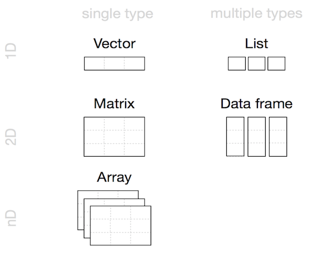
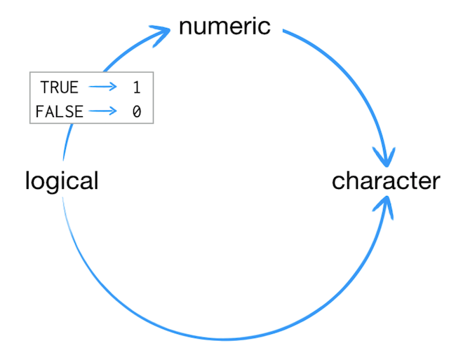
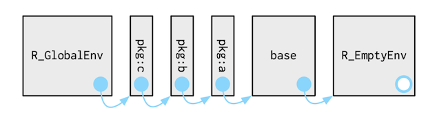
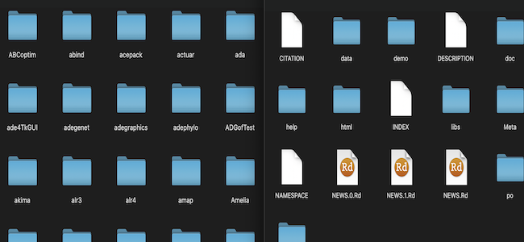
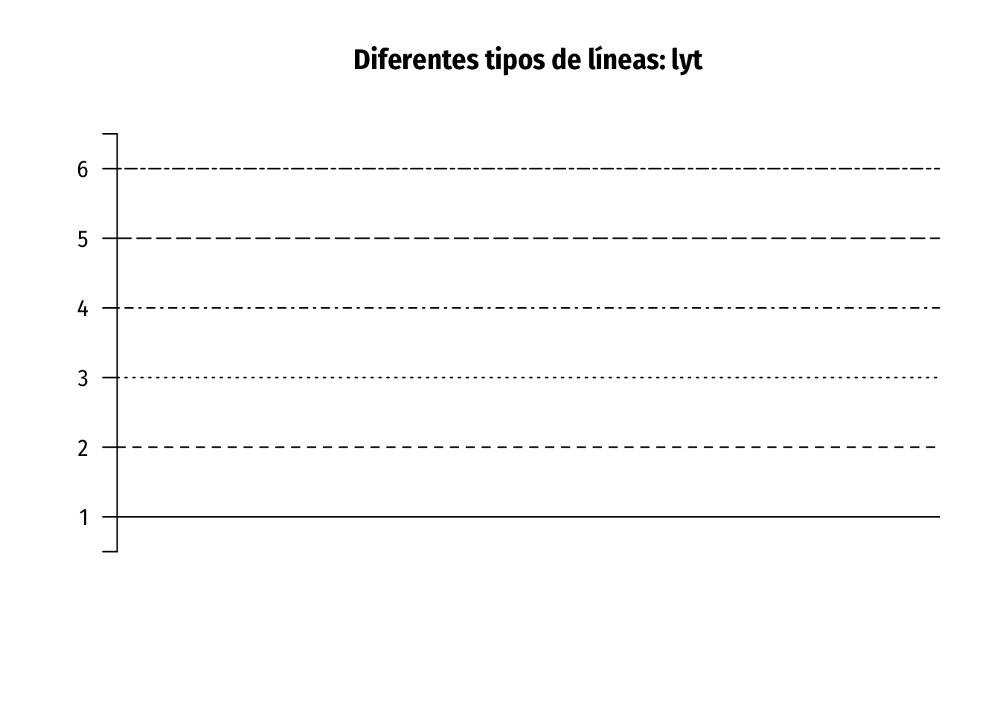
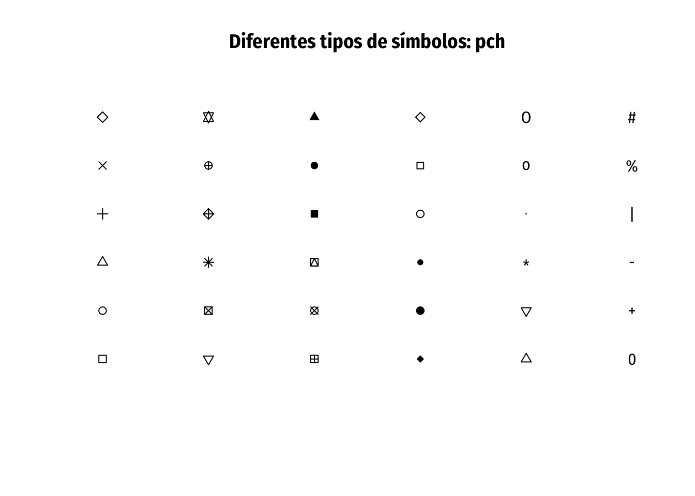
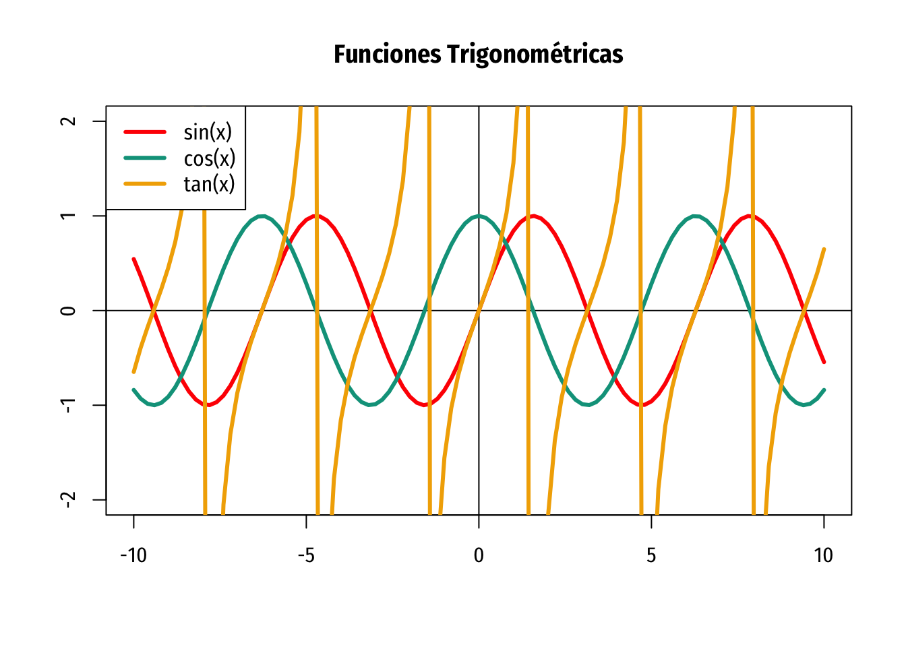
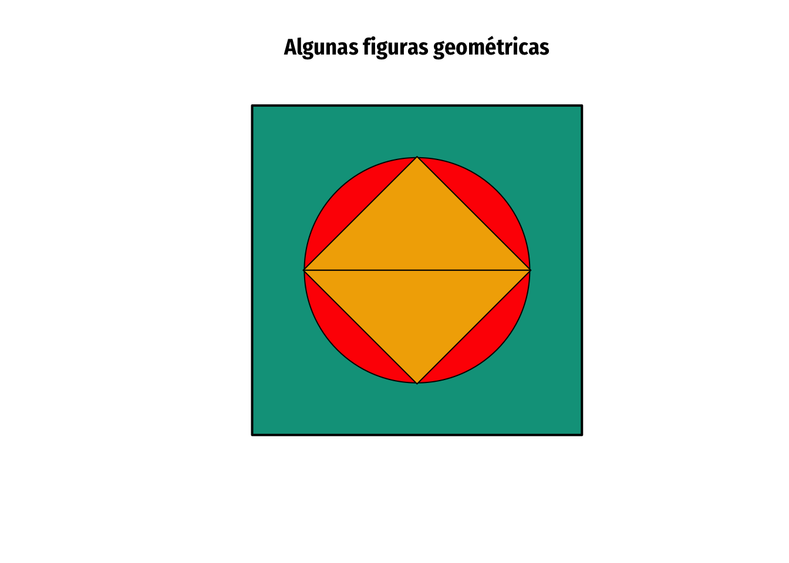

# Conocimientos básicos de R

Este capítulo este destinado cien por ciento a lenguaje de programación R sin uso de algunas otras funciones que provengan de distintos paquetes. Sí se hará mención de algunos paquetes como una alternativa o mejora a diversas funciones que provengan del paquete `base` de R. Por lo mismo, se tratarán algunos conceptos teóricos sobre el comportamiento de este lenguaje, así como sus estructuras, su comportamiento y se presentarán funciones para la creación de gráficas. 

Se asume que previamente se ha tenido un acercamiento al paradigma de programación orientada a objetos por lo que también se añade contenido referente a conceptos relacionados mostrando implementaciones en este lenguaje así como desventajas que puede presentar R fuera del propósito por el que fue creado.

## Buscando ayuda

Por sí mismo, R cuenta con funciones que nos permitirán obtener ayuda sobre R en general pero también sobre las diferentes funciones que estemos usando para resolver algún problema.

Para mostrar un manual de ayuda general en formato HTML corremos el siguiente código en la consola:

```{r, eval=FALSE}
help.start()
```

El manual será mostrado en el panel de ayuda dentro de RStudio pero puede abrirse con el navegador en caso de que así lo deseemos.

Supongamos ahora que dentro de nuestro flujo de trabajo estamos utilizando la funcíón `log()` sin embargo no estamos familiarizados con ella y deseamos obtener ayuda sobre el uso de la función. 

Para a tener acceso a la documentación de la función podemos usar alguna de las siguientes líneas de código:

```{r, eval=FALSE}
help(log)
?log
```

En el caso particular de RStudio, existe un atajo con el que podemos abrir la documentación de cualquier función sin necesidad de correr alguna de las líneas anteriores en la consola.

El atajo consiste de colocar el cursor de texto entre cualesquiera caractéres de la función y presionar el botón F1 de nuestro teclado.

Adicionalmente tenemos las siguientes funciones:

```{r, eval=FALSE}
apropos("plot")
help.search("plot")
```

`apropos()` nos ayudará a encontrar las funciones que incluyan el texto (en este caso _plot_) en su nombre.

Por otro lado, `help.search()` nos mostrará la documentación de las funciones que incluyan el texto, en este caso _plot_.

Como se indica, cualquiera de esas opciones te permitirá tener acceso a la documentación de la funciones donde podrás encontrar: para qué se usan, qué argumentos necesitan, lo que regresan y algunos ejemplos del uso de las mismas. En el caso de buscar información sobre algún paquete instalado, se pueden usar los comandos `vignette(package = "some_package")` o `vignette("some_package")`, al igual que `?library`.

Algunas veces, una buena opción será consultar información creada por diferentes autores. La siguiente es una lista de varios Bookdowns que les pueden ser de gran utilidad y de constante consulta. Al final también se agrega la liga oficial para consultar las CheatSheets disponibles.

+ [R para Ciencia de Datos](https://es.r4ds.hadley.nz)
+ [R para profesionales de los datos: una introducción](https://www.datanalytics.com/libro_r/index.html)
+ [R for Data Science](https://r4ds.had.co.nz)
+ [En general](https://bookdown.org)
+ [RStudio Cheat Sheets](https://rstudio.com/resources/cheatsheets/)

Una buena parte de los errores que podamos encontrarnos en nuestros flujos de trabajo se resolverán al revisar la documentación de la función que esté generando el error, sin embargo habrá ocasiones en las que los errores sean más complejos y la documentación no nos dará una buena pista de cómo remediarlos, en tal caso la mejor estrategia sera utilizar tu buscador favorito para buscar el error.

Será tan fácil cómo copiar el error que la consola esté arrojando y ponerlo en la barra de búsqueda de e.g. [Google](https://www.google.com/). Muchas veces las soluciones las encontrarás en [Stack Overflow](https://es.stackoverflow.com) o en otros medios; por ejemplo, para un problema relacionado a la estadística bien podrías encontrar información valiosa en [Cross Validated](https://stats.stackexchange.com).

## Vectores y operaciones

Quizá ya hayas escuchado lo siguiente en algún lado: _R es un lenguaje vectorial_. 

El comportamiento al que hace referencia esta frase será de mucha ayuda en la construcción de rutinas avanzadas de programación que veremos más adelante, por ahora la implicación más relevante reside en el hecho de que la estructura básica en R serán justamente vectores.

### Vectores atómicos

En todos los lenguajes de programación se tienen diferentes tipos de datos primitivos; por ejemplo en Java se tiene `int`, `long`, `char`, `byte`, etc. Para Python: `String`, `Float`, `Boolean`, entre otros. En R se tienen 6 tipos de datos primitivos, también conocidos como "atómicos". En R, en general todo estará compuesto de vectores o de estructuras hechas con vectores y los datos primitivos no son la excepción, ya que estos también son vectores.

+ Lógicos (**boolean**): `TRUE`, `FALSE`
+ Enteros (**integer**): `5`
+ Double (**doble**): `5.54`
  - Es interesante preguntarse el porqué, en general, un valor en coma flotante se le llama (traducido) doble.
  - En el siguiente [enlace](https://www.quora.com/In-most-programming-languages-why-is-the-primary-type-double-called-so-Simply-because-it-can-express-the-decimals-double-accurate-than-the-float) se hace este interrogante en la página Quora.
  - Los enteros y double son categorizados como vectores numéricos(numeric).
+ Caracteres (**character**): `"word"`
+ Complejos (**complex**): `5 + 7i`
+ Crudos o sin procesamiento (**raw**): `raw(5)`
  - Este tipo de dato se usa para representar una secuencia de bytes.
  - Este tipo de dato, así como los complejos generalmente no se utilizan.
  - En el libro [A Data Scientist's Guide to Acquiring, Cleaning, and Managing Data in R](https://www.wiley.com/en-us/A+Data+Scientist%27s+Guide+to+Acquiring%2C+Cleaning%2C+and+Managing+Data+in+R-p-9781119080022) de Buttrey y Whitaker se muestra un ejemplo del uso de este tipo de vectores.

###### *NOTA*: A partir de aquí, véase el uso de distintas funciones. {-}

Existen algunas funciones de R para saber el tipo de dato que se está usando: `typeof()`, `class()` y `mode()`. Las tres funciones tienen diferentes criterios para determinar que tipo de vector atómico es con el que se está tratando; `typeof()` identifica el tipo de dato visto desde el punto de vista de R y es la función más usada,`mode()` es compatible con S y `class()` identifica el tipo de datos visto desde una POO en R (específicamente el sistema S3).

```{r eval=T, echo=T}
cat(paste(class(TRUE), 
class(5),  
typeof(5.54),
typeof(5L),
mode("word"), 
class(charToRaw("5")), 
typeof(5 + 7i) ,sep = "\n"))
```

En la siguiente tabla se muestra las posibles salidas con todas las variables de prueba.

```{r, echo=FALSE}
dt_types_data <- data_frame(" "= c("TRUE", "5", "5.4", "5L", "word", "charToRaw(\"5\")", "5 + 7i"),
                            "typeof()" = c(typeof(TRUE), 
                                           typeof(5),
                                           typeof(5.54),
                                           typeof(5L),
                                           typeof("word"),
                                           typeof(charToRaw("5")),
                                           typeof(5 + 7i)), 
                            "class()" = c(class(TRUE),
                                          class(5),
                                          class(5.54),
                                          class(5L),
                                          class("word"),
                                          class(charToRaw("5")),
                                          class(5 + 7i)), 
                            "mode()" = c(mode(TRUE),
                                         mode(5),
                                         mode(5.54),
                                         mode(5L),
                                         mode("word"),
                                         mode(charToRaw("5")),
                                         mode(5 + 7i)))
# row.names(dt_types_data) <- c("TRUE", "5", "5.4", "5L", "word", "charToRaw(\"5\")", "5 + 7i")
kable(dt_types_data, align = "cccc") %>%
  kable_styling(bootstrap_options = c("striped", "hover", "condensed", "responsive"))
```

Con lo anterior surge la siguiente pregunta: ¿Hay alguna diferencia entre un vector de tipo `integer` y un tipo `double`?

En general, cuando se están trabajando con datos de punto flotante, se esta considerando una aproximación del verdadero número, tanta aproximación como lo permita la memoria, por lo que pueden existir errores de precisión. De hecho, una manera más adecuada de comparar valores con punto decimal sería utilizando la función `dplyr::near()` en lugar de `==`. Después se tratará el tema de las funciones.

Otro punto interesante es que, dependiendo del tipo de vector, se tiene un distinto representante para los valores faltantes (Missing values); para un entero se tiene `NA` pero con un vector tipo `double` se tienen `NA`, `NaN`, `Inf` y `–Inf`. Un ejemplo de esto se puede obtener al dividir distintos números entre 0.

+ Para un profundizar en esto, se puede ver la [documentación](https://stat.ethz.ch/R-manual/R-devel/doc/manual/R-lang.html#Vector-objects) oficial.
+ Algunos enlaces útiles sobre los vectores numéricos: 
  - [What is the difference between mode and class in R?](https://stackoverflow.com/questions/35445112/what-is-the-difference-between-mode-and-class-in-r).
  - [What's the difference between integer class and numeric class in R](https://stackoverflow.com/questions/23660094/whats-the-difference-between-integer-class-and-numeric-class-in-r).
  
***

### Otros tipos de datos

Además de los vectores atómicos, se tienen otro tipo de vector llamado *factor*. Un factor es un tipo especial de dato en el cual se puede establecer una jerarquía en variables categóricas.

Supongase que se tiene una variable correspondiente al tamaño de un objeto donde los posibles valores son "Big", "Little", "Medium", "Jumbo". Intuitivamente se sabe que esta variable es categórica ordinal por lo que se desearía dejar establecido esta jerarquía en el vector que contenga esta información. 
```{r}
factor(c("Big", "Little", "Medium","Jumbo"))
```

Como se puede observar, se tiene un atributo (más adelante se verán los atributos de un vector) indicando los niveles del factor. Los niveles se establecieron en orden alfabético pero sin ningún orden realmente. Para establecer los niveles se puede dar este atributo directamente desde la creación o modificarlo después de la creación del factor.
```{r}
factor(c("Big", "Little", "Medium","Jumbo"), levels = c("Little", "Medium", "Big", "Jumbo"))
```

De manera análoga, se puede dar el orden a los niveles.
```{r}
factor(c("Big", "Little", "Medium","Jumbo"), levels = c("Little", "Medium", "Big", "Jumbo"), ordered = TRUE)
```

+ ¿Qué sucede si se agregan más datos pero que pertenecen a los niveles?
+ ¿Qué sucede cuando no se agrega un nivel?
+ ¿Qué pasará con los niveles en datos numéricos?
+ ¿Qué pasará con los niveles en datos numéricos pero dados como caracteres?
+ ¿Qué obtenemos al usar `class()` y `typeof()` con un factor?
+ ¿Cómo puede ayudar la función `rev()` en un factor?


En la siguiente [liga](http://www.cookbook-r.com/Manipulating_data/Changing_the_order_of_levels_of_a_factor/) se puede ver un poco más de información sobre este tipo de datos.


En la sección 15 del libro [R para ciencia de Datos](https://es.r4ds.hadley.nz) (traducción al español de R for Data Science de Wickham y Grolemund) se mencionan algunas fuentes para aprender más acerca de los factores, el cual es un tema bastante útil de dominar ya que existe una librería llamada `forcats` con la que se puede trabajar de manera adecuada estos tipos de datos que son de gran ayuda al momento de hacer algún tipo de análisis descriptivo, graficación y creación de modelos. Aquí se enlistan los artículos correspondientes.

+ [Wrangling categorical data in R](https://peerj.com/preprints/3163/)
+ [stringsAsFactors: An unauthorized biography](https://simplystatistics.org/2015/07/24/stringsasfactors-an-unauthorized-biography/)
+ [stringsAsFactors = \<sigh\>](https://notstatschat.tumblr.com/post/124987394001/stringsasfactors-sigh)

Otro tipo de dato con el que se cuenta es aquel que no está definido, es decir, como en Java, un objeto nulo: `NULL`. En las siguientes líneas de código se muestra como hacer comparaciones con este tipo de dato.

```{r}
is.null(NULL)
0 == NULL
NA == NULL
```

Otro punto muy común al analizar datos es encontrarse con información faltante. Aquí, como en otros lenguajes, los valores perdidos son distintos a un objeto no definido; ya que un valor perdido bien puede indicar un error humano al momento del registro de la información pero con la característica de que se puede inferir un posible valor para ese registro faltante. Un `NA` es una constante que puede ser asignada a cualquier tipo de vector a excepción de un vector de tipo `raw`.

Al tener esta ausencia de datos se desea identificarlos de manera rápida y esto puede ser complicado en una base de datos con cientos o miles de registros; al igual que si se tiene el conocimiento de la existencia de estos, se desea que no afecten en operaciones o aplicaciones de funciones en el resto de los datos. Véase lo siguiente

```{r}
sum(c(1,NA,3), c(1,2,3))
```

Es decir, que cuando se tiene algún valor perdido, la operación suma (más adelante se verá a detalle las operaciones en este lenguaje) queda determinada con `NA`. ¿Sucede lo mismo con otro tipo de operaciones?

Como se había mencionado, se desea que si se tiene conocimiento de la existencia de al menos un `NA`, este no afecte a las operaciones

```{r}
sum(c(1,NA,3), c(1,2,3), na.rm = TRUE)
```

Técnicamente, existen cinco missing values para cada uno de los vectores atómicos (a excepción de `raw` claro): `NA`, `NA_interger_`, `NA_real_`, `NA_character_` y `NA_complex_`, pero eso solo es de manera interna.

***

### Asignación de nombres y atributos

Como en cualquier lenguaje de programación, existen identificadores para guardar o asignar el valor de los tipos de datos primitivos o resultados y así utilizarlos posteriormente. En el caso de R, la asociación de un nombre con un cierto valor se puede realizar mediante la función `<-()` y gracias a que R es un lenguaje interpretado, no es necesario declarar el tipo de dato antes de darle una instanciación. Por ejemplo, véase que en las siguientes líneas de código se asignan a algunos vectores atómicos un identificador.

```{r}
a <- 5+7i
b <- 5L
c <- 10
d <- TRUE
e <- NA
```

Y en este caso, basta con llamar a la variable por su nombre para poder usarla.

```{r}
a
c
e
```

También se puede asignar un valor a una variable con el operador `=` pero esto no es nada recomendable ya que, por buenas prácticas, en este lenguaje, se acostumbra a usar el igual para dar valores a parámetros. ¿Qué pasará cuando se ejecute `x <- NULL`? ¿Qué pasará si antes `x` tenía otro tipo de dato?

Aquí se dejan otros ejemplos útiles, más adelante se verá la función `assign()`.

```{r}
roma <- c(0.1, 0.2, 0.3)

assign("mora", c(0.4, 0.5, 0.6))

c(0.7, 0.8, 0.9) -> z

mora <- c(roma, 0, 0, 0, roma)
```

N.B. Los vectores en R no solo pueden ser numéricos también los hay aquellos con cadenas de texto.

```{r}
mora[3]
mora[-3]
mora[c(1,5,7)]
```

Algo que hay que entender sobre R es que este lenguaje esta basado en el paradigma de programación orientada a objetos, aunque también tiene ciertas características de un lenguaje funcional. Existen muchos sistemas para hacer todo lo que se tiene conocimiento de POO en R, como lo es el encapsulamiento, herencia y polimorfismo. Aquí se evitará en la mayor medida posible el tema pero se harán menciones en la marcha de esto. 

Para el caso de los vectores, se tienen ciertos atributos fijos desde su creación: la longitud y el tipo de dato. Más adelante, en las estructuras de datos, se detallará sobre este tema; por el momento, véase lo siguiente

```{r}
a <- c(1,2,3,4,5)
paste0("longitud: ", length(a), ".Tipo de dato: ", typeof(a))
```

Aclaremos ciertas cosas:

+ La manera más rápida de crear un vector es con el constructor `c()` y agregando datos del mismo tipo dentro de él separados con una coma.
  - Si `v_1` es un vector de un cierto tipo y se desea hacer otro vector `v_2` del mismo tipo que contenga el contenido de `v_1` más otros elementos ¿Se puede hacer `v_2 <- c(v_1,...)`?
+ Otra forma de crear cualquier otro vector es con la función `vector("type", length)`.
  - En cierto sentido, usar la última función es una mejor manera de trabajar ya que así se reserva un espacio de memoria para un vector fijo, mientras que con `c()` este puede ir variando.
  - Para crear un vector vacío de una cierta longitud, la función `vector()` es la ideal.
+ Se pueden crear vectores atómicos de cierta longitud con sus valores por defecto al usar los constructores `double(length)`, `interger(length)`, `character(length)`, etc.
+ Arriba se creo una secuencia de números de manera rudimentaria, ya que en R se pueden crear secuencias de números con la función `:`, por ejemplo: 1:5.
+ Con `seq_along()` se puede crear también una secuencia de números; esta la podemos usar en lugar de `1:length(v)` con `v` un vector.
  - ¿Qué pasa en las siguientes instrucciones? `y <- vector("double", 0)`; `seq_along(y); 1:length(y)`.
+ Finalmente, se pueden hacer secuencias cada $n$ números con la función `seq()`: `seq(1,10,by=2)`.
  
Ya que R es un lenguaje de código libre y orientado a objetos, podemos ver el contenido de sus funciones. Para las funciones que están escritas en R podemos ejecutar directamente el nombre de la función omitiendo los paréntesis.

```{r}
integer
```

¿Cómo están hechos los constructores para double, character, boolean y raw?
¿Cómo están hechos los constructores para un complejo y un factor?

Muchas veces es útil comparar distintos tipos de variables o verificar si estas son de algún tipo en específico. Para ello existen ciertas funciones como `is.character()`, `is.na()`, `is.double()`, etc. En general se tiene este tipo de funciones para cualquier objeto, incluso se tiene `is.function()`. En el caso de los posibles valores perdidos de un double, hay que evita usar `==` para verificar los posibles valores como `Inf` y `–Inf`. En su lugar usar las funciones `is.finite()`, `is.infinite()`, e `is.nan()`.

*** 

### Operaciones básicas en R

Es importante que existan operaciones en los lenguajes de programación, y en este caso se tienen las más comunes y algunas especiales.

+ Adición: `5 + 7`; `sum(5,7)`.
+ Sustracción: `5 - 7`.
+ Multiplicación: `5*7`; `prod(5,7)`.
+ División: `5 / 7`.
+ Modulo: `5 %% 7`
+ División entera (piso): `5 %/% 7`.
+ Potencia: `5 ^ 7`; `5 ** 7`.
+ Multiplicación Matricial: `%*%`

Al igual que los clásicos operadores booleanos o relacionales

+ `TRUE & TRUE`.
+ `TRUE & FALSE`.
+ `TRUE | TRUE`.
+ `TRUE | FALSE`.
+ `!TRUE`.
+ `TRUE == FALSE`.
+ `TRUE != FALSE`.

En resumen, tenemos la siguiente tabla

|      Aritméticos      |       Comparación      |    Lógicos    |
|:---------------------:|:----------------------:|:-------------:|
|        Suma (+)       |      Menor que (<)     |    NOT (!)    |
|       Resta (-)       |      Mayor que (>)     |    AND (&)    |
|   Multiplicación (*)  | Menor o igual que (<=) |    OR (\|)    |
|      División (/)     | Mayor o igual que (>=) | Cierto (TRUE) |
|      Potencia (^)     |       Igual (==)       | Falso (FALSE) |
|      Modulo (%%)      |     Diferente (!=)     |               |
| División entera (%/%) |                        |               |

Ahora, lo poderoso de R es poder trabajar de manera vectorial, por lo que las operaciones actúan también de manera vectorial. Los siguientes ejemplos muestran el comportamiento asociado a un lenguaje _vectorial_ que mencionamos:

```{r}
v <- 2*roma+mora+1
v
```

```{r}
1:5 + 2:6
```

```{r}
1:5 * 2:6
```

+ ¿Qué pasará con las siguientes operaciones?
  - `1:5 ^ 1:5`
  - `(1:6) ^ c(2,3)`
  - `s <- seq(1,10, by = 2); s + 7`
  - `sqrt(s)`
  - `1:10 + 1:5`
  - `1:10 * 1:5`
  - `1:10 * 10`
  
Lo que sucedió arriba se conoce como **reciclaje**, lo cual tiene el efecto de repetir de manera ordenada los vectores más pequeños para que ambos vectores que se están operando tengan la misma longitud, esto resulta muy útil cuando se quiere repetir ciertos parámetros en una operación cada $n$ cantidad de pasos. Por ejemplo, si se desea obtener el cuadrado de todos los pares de números del $1$ al $100$, no es necesario hacer algún proceso usando condicionales y algún bucle, sino sólo operar de manera vectorial y usar reciclaje.

```{r}
seq(1,100)^c(1,2)
```

Hay que tener cuidado en algunos casos, por ejemplo `1:4^c(2,4)`.

***

#### Ejercicios {-}

1. <a id="1"></a>El siguiente vector contiene una muestra referente al genero en un grupo de personas: ` c('H','M','M','H','H','M','H','M','H','H','M','M','M','M','M','M','M','M','H','H','H','M','H','M','M','M',`
`'M','H','H','H','H','M','M','M','H','M','H','H','M','H','M','H','M','H','M','M','H','H','M','H')`. Mediante la función `table()` determina la frecuencia de cada categoría usando un factor.

2. Convierte el siguiente vector de caracteres en un vector numérico y obtén la suma de todos sus elementos. `c('7', '50', '7', '18', '42', '37', '20', '11', '33', '38', '28', '3', '16', '40', '3', '40', '36', '37', '1',`
`'6', '8', '23', '25', '48', '5', '22', '21', '21', '1', '5', '8', '48', '34', '16', '4')`. Guárdalo con el nombre `v`.

3. La función `table()` también funciona con elementos numéricos, así que crea una tabla de frecuencias de `v`.

4. Ordena el vector `v` de forma descendente.

5. Se desea categorizar a `v` en 3 grupos (los menores a 4, los mayores o igual a 4 pero menores a 31 y los restantes), por lo que hay que hacer lo siguiente
  i) Crea distintos vectores que contengan sólo los elementos que caen dentro de cada categoría.
  i) Agregar nombres a los vectores de acuerdo al grupo que pertenecen. Pueden usar la función `rep()`. Los nombres serán el número de grupo (Uno, Dos  y Tres).
  i) Une los anteriores vectores en un nuevo vector (puede ser un factor o no).
  i) <a id="5.4"></a>Obtén una tabla de frecuencias para mostrar la cantidad de elementos por cada categoría.
  
6. Obtén los nombres del vector que se obtuvo al final del punto <a href="#5.4">5</a> y guárdalo como una nueva variable. Crea un vector numérico con los datos 1, 2, 3 y con nombres "Uno", "Dos" y "Tres". Utiliza character subsetting para obtener un vector de 1, 2 y 3 con el vector de nombres que se menciono al inicio de este ejercicio.

7. Obtén la raíz cuadrada de los primeros 100 números naturales.

8. Crea un vector numérico y eleva cada elemento a la potencia determinada por la longitud de ese vector.

9. Crea un vector numérico y eleva cada uno de sus elementos al cubo sin usar el operador `^` ni `**`.

10. Con los datos del inciso <a href="#1">1</a> y con la función `seq_along()`, crea un vector con los datos antes mencionados pero que sus nombres sean una indexación de estos.

11. <a id="11"></a>Con los siguientes datos `c('14', '1', '12', '27', '5', '38', '9', '29', '21', '19', '34', '18', '22', '1','26',`
`'18','36', '28', '24','39','36', '21', '36', '28', '8', '13')`, crea un vector booleano determinando que elementos son menores a 26 y con ese vector booleano concluye cuantos datos son menores a 26 y cuantos no lo son.

12. Crea una lista con cinco elementos donde, al menos dos, deben ser listas que contengan listas a su vez.

13. <a id="13"></a>Se desea crear una lista de 10 elementos con las siguientes secuencias de números: `c(1, 2, 3, ..., 10),` 
`c(11, 12, ..., 20), ..., c(91, 92, ..., 100)`. Además cada elemento debe tener nombre.

14. En la lista anterior, cambia el vector `c(40, ..., 50)` por `c(50, 49, ..., 40)` sin escribir explícitamente ese vector.

15. Agrega tu nombre como un atributo a cualquier vector anterior y a la lista del punto <a href="#13">13</a> y convierte la lista a un vector.

## Estructuras de datos

La mayoría de las bases datos contienen más de una variable de acuerdo a una cantidad de observaciones y no necesariamente los datos tiene que ser del mismo tipo de dato. En caso de que se deseara ejecutar algún algoritmo para la manipulación de estos, bien se podría tomar cada variable como un vector y ser ingeniosos y cuidadosos para relacionar todos esos vectores y obtener resultados útiles. Esta manera de trabajar no es eficiente ni la más recomendable, ya que se dedicará una mayor cantidad de tiempo a la programación y una menor a la obtención de resultados.

Existen muchas estructuras de datos y aunque todas pueden ser adaptadas a un lenguaje de programación, cada lenguaje tiene estructuras básicas para trabajar. Java tiene los arreglos y otro tipo de estructuras en ciertas librerías como listas, pilas y colas. Python tiene diccionarios y mediante la librería pandas utiliza marcos de datos (data frames). En el caso de R también se tienen esta última y otras más. La siguiente imagen resume las estructuras de datos en R.

<center> 
<!--  -->


<h6> 

Fuente: 
[Hands-On Programming with R](https://rstudio-education.github.io/hopr/r-objects.html#summary-2).

</h6>
</center>

***

### Vectores

Ya se ha tratado esta estructura pero faltan algunas cosas por ver.

+ ¿Qué sucede cuando se ejecuta el siguiente código? `c(TRUE, 1,2,5,9.4)`.

Lo que sucede aquí es llamado **coercion**. En otros lenguajes de programación esto puede ser entendido como promoción y casteo, pero en este caso no es necesario hacer una declaración explicita del tipo de dato al que se desea convertir. La coerción se aplicará en cualquier estructura que use vectores.

<center>
<!--  -->

<h6> 

Fuente: 
[Hands-On Programming with R](https://rstudio-education.github.io/hopr/r-objects.html#coercion).

</h6>
</center>

En la imagen anterior quedan claras las reglas que se tienen al hacer coerción. Por ejemplo, ¿Qué tipo de vector resultará en las siguientes instrucciones?

```{r echo=TRUE, eval=FALSE}
c("1", "2", 3)
c(4, "a", TRUE)
4 == "4"
1 < FALSE
"a" != FALSE
```

Así como se tienen funciones para verificar si un vector es de algún tipo, también es fácil recordar las funciones para cambiar un tipo de dato a otro; en este caso en lugar de comenzar con el prefijo `is.`, se usará `as.` dando así las funciones `as.double()`, `as.character`, etc. Y esto no se limita a los vectores atómicos, ya que ciertas estructuras se pueden convertir a otras, aunque hay que tener en cuenta que ciertos atributos pueden eliminarse o que en ciertas ocasiones no será posible hacer la conversión.

Finalmente, al tener una estructura que contiene datos, es de esperar una sintaxis para obtener los elementos que la componen. En el caso de los vectores, la obtención de los elementos interiores se puede hacer mediante  de diferentes maneras.

+  Posición de un elemento: `(1:10)[[3]]`. `(1:10)[3]`
  - ¿Cuál es la diferencia entre `[[` o `[` ? Hint: `?'[['`.
+ Posición mediante un vector: `(1:10)[seq(1, 10, by = 2)]`; `(1:10)[c(4,5)]`.
+ Mediante filtros (subsetting) `(1:10)[(1:10)<4]`.
+ Con nombres.

Un atributo que tienen los vectores es llamado `names`, el cual otorga un nombre a cada uno de los elementos interiores del vector.

```{r}
vec_altura <- c(1.50, 1.60, 1.72, 1.55)
names(vec_altura) <- c("José", "Raúl", "Cecilia", "Camila")
vec_altura[["José"]]
```

Por último, véase la aplicación tablas de búsqueda (Character subsetting) que otorga el subsetting en los vectores.

```{r}
datos_frutas <- c("M", "Ma", "S", "M", "S", "Ma")
frutas <- c(M = "Manzana", Ma = "Mango", S = "Sandía")
frutas[datos_frutas]
```
```{r}
unname(frutas[datos_frutas])
```

***

### Listas

Las listas son una estructura de datos muy útil por la forma en la que esta codificada, ya que esta nos ayuda a tener vectores en su interior y de diferentes tipos. Comúnmente se le conoce a las listas como vectores recursivos, ya que una lista puede contener listas en su interior (las listas son otro tipo de objeto así que no hay restricciones para hacer listas de listas). Como bien indica una de las imágenes anteriores, las listas tienen una dimensión, lo cual no se debe confundir con su longitud, la cual es la cantidad de elementos que esta contiene.

+ El constructor por defecto es `list()` y el tipo es `list`.
+ Se pueden dar nombres a los elementos de las listas de la siguiente manera: `list("nombre" = datos)`
+ No es necesario dar nombres para construir una lista

```{r}
list(c(1,5), 1:10)
```
+ Los elementos internos de una lista, al tener la posibilidad de ser diferentes, se pueden tener diferentes tamaños.
```{r}
list(1:2, 1:10, letters[1:5])
```
+ Se tiene la función `is.list()` y `as.list()` como cualquier otra estructura de datos en R.
+ Esta sería una forma de hacer una lista de listas

```{r}
list(list("a","b", "c"), "numeros" = list(1:10,1:5, 10:20, -3:-5))
```
Como las listas y los vectores son de una dimensión, estas estructuras tiene algunas características en común; ambas tienen una longitud y puede determinarse su tipo (`typeof(vector()`, `typeof(list())`). Además en ambas se les puede asignar nombres y otros atributos que se deseen para dar meta data a las estructuras. Para dar un nuevo atributo se puede usar la función `attr()`.

```{r}
lista_1 <- list("numeros" = c(1,2,3), "letras" = c("a","b","c"), "ambos" = c(1,2,"3", "4"))
attr(lista_1, "meta") <- "Más datos"
attr(vec_altura, "atributo_extra") <- "Más datos"
attributes(lista_1)
attributes(vec_altura)
```
Al usar la función `structure()`, no es necesario usar la función `attr()` para agregar un nuevo atributo.

```{r}
structure(seq(2,20, by = 2), paridad = "Pares")
```

+ ¿Qué sucede al hacer `structure(seq(2,20, by = 2), comment = "Pares")`?

En general, para ver la composición de una estructura, La función `str()` es de grán utilidad ya que dará de manera resumida esta composición.

```{r}
str(vec_altura)
str(lista_1)
```

Al poder acceder a los elementos de un vector o una lista, es sencillo cambiar el contenido de estos.

```{r}
lista_1[["numeros"]] <- 2:4
lista_1
```

```{r}
vec_altura[vec_altura<1.60] <- 1.50
vec_altura
```

+ El acceso a una lista puede ser de diferentes maneras
  - Mediante el nombre del elemento: `lista_1[["numeros"]]` o `lista_1$numeros`.
  - Mediante la posición: `lista[[1]]`
  - ¿Cuál es la diferencia entre `lista[[1]]` y `lista[1]`?
  
```{r}
lista_1$ambos <- NULL
str(lista_1)
```

Lo anterior es un ejemplo de como borrar elementos de una lista.

+ ¿Esto se puede hacer con un vector? ¿Si, no, porqué? `r emo::ji("doubt")`
  - Hint: ¿Qué sucede al hacer lo siguiente? `v <- 1:10`; `v[5] <- "5"`.
+ ¿Es posible convertir una lista a un vector? Sí, pero ¿Por qué `as.vector(lista_1)` sigue siendo una lista?
+ ¿Qué hace `unlist()`?
+ ¿Qué atributos permanecen al hacer hacer una correcta conversión?  

***

### Arreglos

Todos aquellos que ya hayan tenido algún acercamiento con algún lenguaje de programación como Java, C, C++, Python, etc. conocen lo importante que pueden ser los arreglos, los cuales son una colección de elementos con ciertas posiciones. Además del simple hecho de poder almacenar elementos en un solo objeto, es de gran importancia lograr manejar matrices para realizar distintas operaciones y obtener ciertos resultados para diferentes problemas del ámbito científico.

Como bien se indica en el diagrama donde se presentan las diferentes estructuras de datos que tenemos disponibles en R, las matrices y los arreglos solo aceptan un sólo tipo de dato como los vectores. De hecho, véase que internamente, los constructores de una matriz y un arreglo (`matrix()` y `array()`) tienen que convertir, en caso de que sea necesario, el input a un vector.

```{r echo=FALSE}
cat(paste(c("#matrix():",".",".",capture.output(matrix)[3:4],".",".", "}",
            "#array():",".",".",capture.output(array)[5],".",".", "}"),
          collapse = "\n", sep = "\n"))
```

Por lo que una matriz y un array los podemos considerar vectores, solo que con diferentes dimensiones. Solo para aclarar, al momento de ingresar listas o matrices a estos constructores, todo será llevado a vectores y se realizará, en caso de ser necesario, coerción y reciclaje.

+ ¿Qué sucede al ejecutar `matrix(list(1,2,3,4))`?

Considérese los siguientes puntos cuando se desea construir una matriz o cuando se trabaje con ellas.

+ Se tienen las correspondientes funciones `is.matrix()` y `as.matrix()`.

+ El constructor `matrix()` en su primer argumento solicita los datos los cuales pueden ser cualquier vector.

```{r}
matrix(1:10)
```
+ Automáticamente `matrix()` dispone de sus elementos en forma columnar.
+ El constructor de las matrices permite agregar el número de renglones y columnas.

```{r}
matrix(1:10, nrow = 5, ncol = 2)
```
+ La matriz se rellena en base a columnas, pero esto puede ser modificado. ¿Cómo?

```{r echo=FALSE}
matrix(1:10, nrow = 5, ncol = 2, byrow = TRUE)
```
+ Se puede acceder a los elementos de una matriz de manera análoga a los vectores y listas solo que considerando las dos dimensiones.

```{r}
matrix(1:10, nrow = 5, ncol = 2, byrow = TRUE)[1,1]
```
+ Si no se indica algún valor, o ambos, para alguna dimensión, R entenderá que se desea abarcar toda esa dimensión.

```{r}
matrix(1:10, nrow = 5, ncol = 2, byrow = TRUE)[,2]
```
+ También es posible acceder mediante nombres en una matriz. En este caso existe la distinción entre renglones y columnas, y las correspondientes funciones para obtener y modificar los nombres son `rownames()` y `colnames()`.

```{r}
m <- matrix(1:10, nrow = 5, ncol = 2, byrow = TRUE)
rownames(m) <- paste("Row", 1:5)
colnames(m) <- paste("Column", 1:2)
m
```

```{r}
m["Row 5","Column 2"]
```
+ Al igual que en los vectores, se puede acceder mediante vectores booleanos o expresiones que resulten en vectores booleanos.

```{r}
m[1,m[1,]<2]
```

+ El equivalente de `length()` en vectores, se divide en `nrow()` y `ncol()`; además de la función `dim()` para obtener ambos resultados

```{r}
cat("nrow: ",nrow(m), "\nncol: ",ncol(m), "\ndim:", "c(",dim(m),")")
```
+ La función `dim()` se puede usar para modificar la estructura de una matriz; aunque esto puede ocasionar una pérdida de atributos.

```{r}
dim(m) <- c(2,5)
m
```
+ La función anterior puede usarse también con vectores. Al hacer esto ¿El resultado es una matriz? Compruébelo.

```{r}
vec <- 1:10
dim(vec) <- c(5,2)
vec
```

+ Con las funciones `cbin()` y `rbind()` se pueden unir matrices por columna o por renglón.

```{r}
first <- 1:10
second <- 2:11
cbind(first, second)
```

Las matrices son de uso recurrente en el álgebra lineal, por lo que se desearía realizar algunas operaciones básicas entre ellas; R proporciona estas así como algunas funciones importantes. Supongamos que $\mathcal{A}$ y $\mathcal{B}$ son matrices definidas en R. 

+ Operaciones básicas
  - Adición:$\mathcal{A}$`+`$\mathcal{B}$.
  - Sustracción: $\mathcal{A}$`-`$\mathcal{B}$.
  - Multiplicación por un escalar: $c$`*`$\mathcal{A}$.
  - Producto matricial: $\mathcal{A}$`%*%`$\mathcal{B}$.
  
+ Funciones básicas
  - Transpuesta: `t()`.
  - Diagonal: `diag()`. Devuelve la diagonal de una matriz o crea una matriz diagonal.
  - Determinante: `det()`.
  - Inversa: `solve()`. `solve()` también resuelve un sistema de ecuaciones dado.
  - Varianza: `var()`.
  - Vectores y valores propios: `eigen()`.
  
Hay que tener en cuenta la teoría sobre estas operaciones o funciones ya que será relevante las dimensiones de las matrices; por ejemplo si las matrices son cuadradas para obtener el determinante o la inversa o si las dimensiones de $\mathcal{A}$ y $\mathcal{B}$ son adecuadas para aplicar, por ejemplo, la multiplicación entre ellas. Para ver algunas otras funciones que se pueden aplicar en las matrices véase los enlaces [1](https://rpubs.com/Cesar_AHN/operaciones_con_matrices_multiplicacion_determinante_inversa_factorizacion_descomposicion_grafica) y [2](http://www.philender.com/courses/multivariate/notes/matr.html).

Finalmente, cuando se desea crear un arreglo con un número mayor de dimensiones, se puede utilizar el constructor `array()` donde se pueden indicar las dimensiones como parámetro, por ejemplo `array(1:16, c(2,2,4))`. Las operaciones básicas funcionan correctamente en este tipo de estructura pero la mayoría de las funciones, al menos todas las mencionadas, no trabajan bien al tratar con arreglos ya que las funciones anteriores solicitan arreglos de dos dimensiones.
  
+ ¿Una matriz es un arreglo y un arreglo es una matriz?

***
### Data Frames

Al trabajar con matrices se debe estar consciente de que cada uno de sus elementos es de un solo tipo, lo cual puede resultar problemático al tratar con una base de datos donde se tengan datos numéricos y categóricos o incluso cuando se desee agregar una columna de otro tipo de objetos como lo son las gráficas. Aquella estructura de datos que dos dimensiones que acepta diferentes tipos de datos por columna se le llama __Data Frame__. La mayoría de las bases de datos se trabajan con un data frame y por convención a las columnas se les llama variables y a los renglones observaciones. 

La construcción de un data frame se puede hacer mediante el constructor por defecto `data.frame()` donde el contenido de este es similar al de una lista, ya sea dando los nombres desde la creación o posteriormente. Por ejemplo:

```{r}
data.frame(c1 = 1:5, c2 = letters[1:5], c3 = list(1,2,3,4,5), c4 = matrix(0,5,2))
```

Hay que notar lo siguiente del anterior ejemplo.

+ Los vectores son tomados de manera columnar como en las matrices.
+ Los caracteres son considerados como factores; esto puede cambiar modificando el parámetro `stringsAsFactors` del constructor.
+ Por cada elemento de la lista se agrego una columna.
+ Las matrices son tomadas con la misma estructura en cuanto a los renglones y columnas.

Estos puntos son considerados en cuenta cuando se desea convertir algún otro objeto en data frame con la función `as.data.frame()`.

+ Se debe ser cuidadoso con el número de observaciones en cada variable, ya que estos deben ser iguales, lo cual puede ser relevante al usar las funciones `rbind()` y `cbind()` entre data frames. En general, estas funciones deben usarse si alguno de los objetos implicados es un data frame, en caso de que alguno no lo sea y ambos sean vectores, las funciones crearán primero una matriz aplicando coerción y dando problemas en la construcción del data frame.

El constructor de una data frame, `data.frame()`, es más robusto que el constructor de una matriz, `matrix()`, ya que aquí se deben mantener las estructuras en las columnas; por ejemplo una columna de listas no deben convertirse en una columna de números como en el caso de una matriz para una sola lista. Si se desea tener una columna de listas y no distribuir los elementos de la lista en las columnas de data frame, se puede utilizar la función `I()` la cual ayuda a tratar un objeto como el mismo y así no aplicarle algún tipo de transformación.

```{r}
(df <- data.frame(numbers = 1:3, listas= I(list(num_list = 1:10,letras = letters,listas = list(1,2,3,4)))))
```

Al igual que las listas, el acceso puede ser mediante los nombres y posición además de vectores booleanos, agregando el acceso que se aplica en las matrices.

```{r}
df$listas$letras
df[["numbers"]]
df[1,2]
df[1,2]$num_list
df[2,c(typeof(df$numeros), typeof(df$listas))=="list"]
```

+ Es posible agregar nombres a los renglones de un data frame como en una matriz.

```{r}
row.names(df) <- 1:3
df
```

+ ¿Qué sucede al usar la función `as.matrix()` con el anterior data frame?
+ ¿Se puede cambiar la dimensión de un data frame como en una matriz usando la función `dim()`?
+ ¿Se pueden aplicar operaciones básicas entre data frames? ¿Cuáles y en que caso?

No esta de más mencionar que hay otro tipo de objeto en R llamado *expresiones*. Estas son importantes al momento de desarrollar una función a un nivel más profesional. En este libro no se tratará dicho tema pero se puede estudiar a profundidad de esto en el libro [Advance R](https://adv-r.hadley.nz). Aquí se deja un simple ejemplo de tal objeto.

```{r, eval=FALSE}
x <- 3
y <- 2.5
z <- 1

exp <- expression(x/(y + exp(z)))
```

***

#### Ejercicios {-}

16. <a id="16"></a>La siguiente instrucción genera un vector con valores numéricos y `NA`: `sample(c(1:20, rep(NA,15)))`. El anterior vector se debe guardar con el nombre de random_NA y Usando algún ciclo, determine cuantos valores `NA` hay en random_NA.

17. Utilizando los conocimientos de coerción, la función `sum()` y lo que sea necesario, determinar cuantos valores `NA` existen en random_NA.

18. Crea una función que, dado un vector, se determine la cantidad de valores perdidos en él.

19. Crear un función que, dado un número se cree una matriz que contenga solo ese número. El número de renglones y columnas debe también ser dado en los parámetros de la función.

20. <a id="20"></a>Usando algún ciclo, crear una función llamada `suma_gauss` en la que se tendrá que simular el proceso para la suma de los primeros $n$ números en $\mathbb{N}$. No se debe utilizar la formula de manera directa.

21. Crear una matriz, sin tener que usar algún ciclo, de 0s y 1s alternados. Aquí un ejemplo

```{r, echo=FALSE}
matrix(rep(c(0,1), 20), nrow = 5, ncol = 4)
```

22. <a id="22"></a>Crear un data frame de la siguiente matriz.

```{r, echo=FALSE}
matrix((1:20)^2, nrow = 4, ncol = 5)
```

23. Crear un data frame con 5 variables y al menos 3 observaciones. La primera variable corresponderá a nombres de una persona, las demás representarán la edad, altura, peso y nacionalidad de cada individuo. Se puede usar la función `sample()`.

24. En el anterior data frame, agregar una sexta variable que represente los videojuegos que tiene cada usuario. Los datos deben ser los siguientes: `list(juegos = c("Horizon-Zero-Dawn", "bloodborne"))`, `list(juegos = c("Mario-Kart", "Mario Maker", "Mario Odyssey"))`, `list(c("Halo", "Batman Arkham Knight", "Injustice"))`. Si hacen falta más datos, crearlos o replicar los ya dados.

25. Crear un función que regrese una lista donde cada elemento de la lista tendrá el nombre de cada una de las estructuras y los tipos de datos ya vistos y su contenido será un vector booleano indicando si, de acuerdo al parámetro de la función, se es de alguna clase de las ya vistas. Por ejemplo, si se da como input una matriz de caracteres, la lista resultante en la posición `[["Matriz"]]` y en `[["Caracter"]]` deben contener el valor `TRUE`.

26. <a id="26"></a>Obtener la siguiente matriz usando la función `paste()`.

```{r, echo=FALSE}
matrix(paste(letters[1:20], LETTERS[1:20]), nrow = 4, ncol = 5)
```

27. Del data frame del inciso <a href="#22">22</a>, obtener mediante una expresión lógica las columnas, que de acuerdo al primer renglón, contengan valores menores a 150.

28. Crea una lista que contenga al menos cada una de las estructuras ya vistas.

29. Crear una función que, dadas dos matrices, se verifique si estas son aptas para aplicarles las operaciones fundamentales suma y sustracción y regresar dichos resultados en una lista; en caso de que sean aptas para la multiplicación agregar este resultado a la lista de retorno.

30. Crear un ciclo dentro de una función donde, de acuerdo a un data frame de entrada, y utilizando la primera observación del data frame, se determine el tipo de variable que contiene el data frame en cada columna. Finalmente todos los resultados deben ser devueltos en un vector.

## Sentencias de control, ciclos y funciones

Todo el conocimiento ya obtenido no sería útil a largo plazo si no se tiene alguna manera de controlar el comportamiento del código bajo ciertas circunstancias, ya sea permitiendo ciertos bloques de código, repitiendo o ejecutando una cantidad determinada o indeterminada de veces un cierto proceso o aplicar ciertas transformaciones a los resultados. Por todas estas razones comenzaremos con la estructura de control más básica.

***

### If & If-else

La estructura `if()` permite la ejecución de un cierto bloque de código si el parámetro booleano que recibe tiene por valor `TRUE`, lo cual indicaría que la condición necesaria para la ejecución del bloque es válida. Recordemos que un valor `TRUE`, y en general un booleano, se puede obtener mediante diferentes expresiones usando operadores lógicos.

```java
if(boolean) {
  código
} 
```

Ahora, suponiendo que se desea tratar el simple problema de determinar si un usuario, de acuerdo a su edad, puede ver cierto contenido. Se puede actuar de la siguiente manera

```java
if(edad>=18) {
  Permitir_contenido
}
if(edad == 17){
  No_permitir_contenido
}
if(edad == 16){
  No_permitir_contenido
}
.
.
.
if(edad == 0){
  No_permitir_contenido
}
```

O bien de la siguiente manera

```java
if(edad>=18) {
  Permitir_contenido
}
if(edad < 18){
  No_permitir_contenido
}
```

En cualquiera de los dos casos es necesario tratar el complemento con otra sentencia `if()` lo cual no es recomendable cuando no se tenga certeza de todos los casos contrarios a la condición en el primer `if`. Por lo cual, para tomar el complemento, se tiene la sentencia `if-else`; donde si sucede la condición, se ejecuta el código dentro de los delimitadores del `if` y en caso contrario (`else`) se ejecuta lo correspondiente para el complemento de la condición.

```java
if(edad>=18) {
  Permitir_contenido
}else{
  No_permitir_contenido
}
```

Existe en R la función `ifelse()` la cual permite trabajar de manera vectorial. Véase el siguiente ejemplo

```{r}
#Se crea un vector con 15 edades de personas de manera "aleatoria"
(edades <- sample(1:90, replace = T, size = 15))
ifelse(edades<18, yes = "Menor de edad", no = "Mayor de edad")
```

Es decir, que en cada entrada del vector evalúa la expresión dada y en caso de ser cierta la condición, se devuelve, en este caso, el caracter "Menor de edad" y en caso contrario "Mayor de edad". Véase que la función `ifelse()` regresa un vector.

***

### For, While y Repeat

Cuando un programador ve que un proceso se debe repetir una cantidad de veces, automáticamente piensa en un bucle. En el caso de R se tienen los ciclos `for()`, `while()` y `repeat()`.

Recordando que en Java los primeros dos bucles tenían una estructura similar a la siguiente:

```java
for(int i = 0; i<n; i++){
  Ejecución del código n veces
}

while(boolean){
  Ejecución del código hasta que el booleano sea false
}

```

En el caso de R se tendrá una estructura un poco diferente ya que se iterará directamente sobre un objeto y no usando una variable auxiliar que evalué una expresión para obtener un booleano y determine si el ciclo termino. En el caso del ciclo while se tiene la misma sintaxis.

```java
for(elementos in objeto){
  Ejecución_del_código
}

while(boolean){
  Ejecución_del_código
}
```

Véase los siguientes ejemplos

```{r}
for(number in 1:5){
  print(number + 1);
}
```

Se esta usando directamente cada elemento dentro del vector para ejecutar un cierto bloque de código. Hay que aclarar que no es necesario usar el elemento con el que se está iterando aunque es común hacerlo.

+ ¿Funcionará con una lista o una matriz?

```{r}
for(letra in letters[1:5]){
  print(paste("Letra ", letra))
}
```

En el anterior código se esta usando otro vector, el cual es no numérico, dando un mejor ejemplo de que el iterador no esta dependiendo de valores numéricos.


```{r}
edad <- c(20,24,41,17,20)
n_cliente <- 1
control_parental <- TRUE
while(control_parental){
  if(edad[n_cliente]>=18){
    print("Apto para la película")
    n_cliente <- n_cliente+1
  }else{
    print("Menor de edad")
    control_parental <- F
  }
}
```

Aquí se están usando expresiones de control para determinar la salida del bucle.

Hay que recordar que en un ciclo `while` se corre el peligro de entrar en un ciclo infinito, el cual sería lo deseado en algunos casos. Un ciclo que se trata con un bucle tipo `for` siempre puede ser tratado como uno tipo `while` pero no siempre el caso contrario. Y que la elección entre un ciclo `while` y uno `for` depende de si se conoce el número de veces que se ejecutará un bloque o no.

+ ¿Existe algo equivalente al `switch-case` visto en Java?

Para estos dos ciclos se puede hacer uso de las sentencias `break` y `next`, las cuales permiten la interrupción de un ciclo y la exclusión de alguna iteración.

```{r}
for(letra in letters){
  if(letra == "f") break
  print(letra)
}
```

Cuando se ejecuta `repeat` el ciclo termina sin importar la existencia de más iteraciones sobre el objeto.

```{r}
for(letra in letters){
  if(any(letra == letters[4:24])) next
  print(letra)
}
```

Para el caso de `next`, véase que se saltó ciertas iteraciones más no termino el ciclo.

Finalmente, R proporciona la estructura `break`, en la cual puede encontrarse cierta similitud con un ciclo `while` o `do-while`.

```python
repeat{
  .
  .
  ejecución_código
  .
  .
  break
}
```

Este bucle se detiene cuando se encuentra a la sentencia `break`.

```{r}
n_saludos <- 5
repeat{
  print(rep("Hola", n_saludos))
  #Se detiene el repeat cuando n_saludos sea igual a 1
  if(n_saludos==1){
    break
  }
  n_saludos <- n_saludos-1
}
```

Existe un "problema" con los ciclos en R debido a las configuraciones internas para el almacenamiento de objetos. Por el momento es suficiente saber que trabajar de manera vectorial o aplicar funciones que están en R de manera predeterminada es una mejor y más rápida forma de trabajar. Más adelante se verá en que casos los ciclos pueden ser "lentos" además de otros problemas que pueden surgir, por ejemplo en la recursión, y cuando será la mejor opción usar un ciclo que alguna función que trabaje de manera vectorial.

***

### Funciones

Como ya se había mencionado, R es un lenguaje de programación orientado a objetos aunque también tiene ciertas características de un lenguaje funcional ya que las funciones en R pueden considerarse [funciones de primera clase](https://en.wikipedia.org/wiki/First-class_function); es decir que pueden ser asignadas a variables, ser almacenadas en ciertas estructuras como las listas, servir como parámetros de otras funciones y ser el retorno de otras funciones. Aunque estas no pueden ser consideradas, como bien dice Handley Wickham en su libro RAdvance, puras; es decir [funciones de orden superior](https://en.wikipedia.org/wiki/Higher-order_function) ya que, para que una función sea considerada de orden superior, de acuerdo a un input dado, se debe tener una única salida (inyectividad) lo cual no sucede con muchas funciones en R como `sample()`, `runif()`, `print()` y hasta en `<-()`.

Sin importar que las funciones no sean de orden superior, lo cual otorga cierta flexibilidad, es indudable la importancia de crear funciones para optimizar el trabajo, dar estructura, limpieza e incluso claridad; ya que al usar una función, el resultado será algo esperado sin importar su comportamiento interno; en cambio al visualizar un ciclo, este puede no quedar claro en su funcionamiento.

La creación de funciones es sencilla

```java
nombre_function <- function(parámetros){
  código
}
```

+ Los parámetros pueden ser cualquier objeto e incluso funciones. En este último caso, a estas funciones se les llama **_funcionales_**.
+ El retorno de una función puede quedar explícitamente dado con la función `return()` aunque si no se utiliza esta función, la última línea de código en la función es considerada como el retorno de la función. El retorno puede ser cualquier tipo de objeto e incluso pueden devolver funciones. En este último caso, a estas funciones se les llama **_function factory_**.
+ Cuando una función tiene como valor de retorno un booleano, a esta función se le conoce como **_predicate_** y cuando una función acepta una o más funciones como parámetros y a su vez regresa funciones, se les conoce a estas funciones como **_function operator_**.

Los parámetros de una función pueden tener valores por defecto, los cuales pueden ser reescritos cuando se den explícitamente otros valores.

```{r}
suma <- function(v1 = c(1,2), v2 = c(3,4)){
  sum(v1, v2)
}
suma()
suma(v1 = 4, v2 = 1:20)
```

Algo interesante de las funciones en R, al igual que en Python, es que se pueden dar una cantidad indeterminada de parámetros si así se indica en la función con el argumento `...`. Véase el siguiente ejemplo.

```{r}
#v1 y v2 vectores numéricos
suma <- function(v1, v2, ...){
  sum(v1, v2, ...)
}
```

Es decir, que se está considerando `...` como un parámetro más de la función aunque nótese que no es necesario agregar más de dos variables en la función.

```{r}
suma(c(1,2), 1:4)
```

```{r}
suma(c(1,2), 1:4, 1:20)
```

***

#### Ejercicios {-}

31. Crear un nuevo operando y utilizarlo con dos vectores.

32. En el siguiente enlace se puede encontrar información sobre la función [`replicate`](https://aosmith.rbind.io/2018/06/05/a-closer-look-at-replicate-and-purrr/#the-replicate-function). Teniendo en mente que la anterior función puede remplazar a un ciclo for, realice el ejercicio <a href="#16">16</a> utilizando dicha función. Vea que sucede al utilizar el parámetro `simplify` con los valores `FALSE` y `TRUE`.

33. Aplicar las funciones `min()` y `max()` en la matriz del ejercicio <a href="#22">22</a> sobre los renglones y columnas.

34. Con la lista creada al momento de explicar la función `lapply()`: `list(a = seq_matrix, b = seq_matrix+1, c = seq_matrix+3)`, utilizar tal lista, la función `lapply()` y una función anónima, para sumarle 5 al elemento [2,3] de cada matriz.

35. Con base en el ejercicio anterior, hacer una función que acepte una lista (como la del anterior ejercicio), un parámetro tipo String; los posibles valores de este serán "suma", "resta", "mutl", "div"; también debe aceptar tres parámetros numéricos, el primero servirá como operando de las operaciones anteriores y los siguientes como coordenadas para ubicar el elemento en las matrices. De acuerdo a las operaciones anteriores, realizar pora cada caso con la función `lapply` y una función anónima la operación correspondiente al elemento designado por los parámetros de la función.

36. Observese que sucede al ejecutar `(1:10)[-1]`. Obtener de la lista del ejercicio <a href="#13">13</a> los últimos 5 elementos de cada vector.

37. Crear una función que, dada una lista, se determine que tipo de datos son sus elementos.

38. Imprimir una sequencia de vectores con `sapply()`.

39. Crear un nuevo operando que sea capaz de concatenar un número con una letra.

40. Utilizar la función del ejercicio anterior para concatenar a los elementos de una matriz de caracteres un número.

41. Utilizar el operando anterior para concatenar un número a todos los elementos de la matriz del ejercicio <a href="#26">26</a>.

42. Usando la función `which()`, obtener los resultados solicitados del ejercicio <a href="#11">11</a>.

43. Usando alguna función de la familia `apply` y una función anónima, obtener los resultados solicitados del ejercicio <a href="#11">11</a>.

44. Obtener el máximo y mínimo de cada uno de los elementos en la lista del ejercicio <a href="#13">13</a>.

45. <a id="45"></a>Crear una función que acepte una matriz y devuleva una lista con dos elementos: "StatsColumns" y "StatsRows"; los cuales deben ser listas y contener los resultados de aplicar las funciones `sum()`, `prod()`, `sqrt(sum())` y `cumsum()` por renglones y columnas.

## Funciones

El tema de las funciones es algo extenso, por lo que se dará de manera resumida el contenido necesario para entender gran parte del funcionamiento de estas en R. Una de las mejores fuentes de información la pueden encontrar en el libro [Advance R](https://adv-r.hadley.nz), específicamente en los capítulos 6 y 7; para explorar más sobre este tema se puede consultar la segunda parte de la misma referencia. Finalmente, se verá como usar vectorización, una de las fuertes habilidades de R, y por último una serie de funciones que podrían ser de gran utilidad en ciertos temas.

Particularmente en la programación con R, será de mucha utilidad aprender a crear funciones:

```{r, eval=FALSE}
funcionfactorial<-function(a){
  res <- 1
  if(a<0){
    return("No existen factoriales de números negativos.")
  } else if(a==0){
    return(res)
  } else{
    for(i in 1:a){
      res <- res*i
    }
    return(res)
  }
}
```

***

### Funciones

Una función que crea el usuario se compone de tres partes: los __*formales*__, los cuales son los argumentos o los parámetros de una función y que pueden obtenerse con la función  `formals()`, el __*cuerpo*__, es decir el código o las rutinas internas de las funciones que se pueden obtener con la función `body()`, y un __*ambiente*__, el cual se puede obtener con la función `environment()` y que básicamente es un lugar donde esta almacenada la información necesaria para el correcto uso de las funciones; más adelante se hablará un poco más de este importante concepto.

+ ¿Qué tipo de estructuras o qué tipo de objetos regresan las anteriores funciones?
+ ¿Cuáles son los tres componentes en la siguiente función?

```{r}
myStrangeFunction <- function(a = 1,b = 4,c,...) sum(prod(a,b), c, ...)
```


Como ya se mencionó, este lenguaje toma ciertas características de un lenguaje funcional, por lo que al tratar a las funciones como objetos es de esperarse la incorporación de atributos a estas. Uno de estos atributos es el llamado **_srcref_** (source reference), la cual imprime mejor el cuerpo de alguna función.

+ ¿Con qué función se agregaría un atributo a una función?
+ ¿Cómo se puede obtener el atributo **_srcref_** de `myStrangeFunction`? El output es el siguiente

```{r, echo=FALSE}
attr(myStrangeFunction , "srcref")
```

R contiene ciertas funciones que son añadidas al momento de iniciar su interfaz, las cuales se han agregado a las distintas versiones del lenguaje y a medida que R ha evolucionado se han optimizado estas funciones internas dando un buen rendimiento para su uso cotidiano. Estas funciones son llamadas **primitivas** y ya se han visto algunas de estas: `sum()`, `prod()`, `[()`, `sqrt()`, etc. Algunas de las funciones primitivas están implementadas y existen en el lenguaje _C_, lo cual da garantía de un buen rendimiento. Los tres componentes que se mencionaron antes no los tienen este tipo de funciones y así es posible verificar si una función primitiva existe principalmente en _C_.

+ ¿Cómo se puede ver si una función es primitiva o no?
+ Si las funciones primitivas otorgan un buen rendimiento ¿Porqué no todas las funciones son primitivas?

```{r, echo=FALSE}
sum
```


Para utilizar, o mejor dicho _llamar_, a una función, basta con escribir su nombre, colocar los argumentos separados por coma dentro de unos paréntesis y ¡listo! Aunque se ha mencionado que `+` también es una función: `'+'()`, por lo que hay que discernir las diferentes formas de llamar a una función.

+ **prefix**: `myFunction(arguments)`.
+ **infix**: `a+b`.
+ **replacement**: `colnames(df) <- names`.
+ **special**: `[[`, `if`, `for`, etc.

Véase que las propias estructuras de control y los bucles también son funciones y R permite modificar todo aquello que sea función, aunque todas las formas especiales son funciones primitivas. No es recomendable sobre escribir alguna función que ya se tenga preestablecida en R o en alguna librería, pero siempre se tiene la libertad de hacerlo en caso de que se tenga el control y la consciencia suficiente de las consecuencias.

Solo para aclarar, véase los siguientes puntos.

+ Todas las funciones se pueden llamar a manera de prefijo.

```{r, eval=FALSE}

myFunction(a,b,c)

`+`(a,b)

`colnames<-`(df, names)

for(name in names) print(name)
`for`(name, names, print(name))

```

+ Como `+` es una función, es posible crear operadores usando `%` al inicio y al final del operador. Todos los operadores de R se pueden encontrar ejecutando `?Syntax`. 

```{r}
`%mixOperations%` <- function(a,b) a+b*a/b
4 %mixOperations% 5
```

+ Algunas funciones útiles de este estilo son `%%`, `%*%`, `%/%`, `%in%`, `%o%` y `%x%`. ¿Qué hacen cada una de ellas?

+ Es análogo la sintaxis para crear funciones de asignación aunque es necesario tener el formal `value`.

```{r}
`indexNames<-` <- function(a, value) {
    names(a) <- as.character(seq_along(a)+value) 
    a
  }
x <- 1:20
indexNames(x) <- 3
x
```

Ahora, véase la siguiente función

```{r}
ignoringParameters <- function(x) "Hello!"
ignoringParameters(1:30)
```

Sea cual sea el objeto que se de como parámetro al llamar la función, se devolverá el mismo resultado. Esto es posible porque las funciones en R trabajan de manera "perezosa" con sus argumentos, a esto se le llama **_lazy evaluation_**. Básicamente, si no es llamado en algún momento un argumento de la función, este no es utilizado y solo cuando se llame al argumento, hasta ese momento se hará el acceso a él.

Esto es gracias a la técnica de evaluación [lazy evaluation](https://en.wikipedia.org/wiki/Lazy_evaluation) que utiliza R al usar una estructura de datos llamada [promise](https://en.wikipedia.org/wiki/Futures_and_promises) donde, básicamente las variables son evaluadas mediante un ambiente hasta que una expresión las utilice y este valor es guardado (_cached_), por ejemplo

```{r}
y <- 7
lazilyEvaluated <- function(x, lazy_var = y*a){
  print("Hi!")
  y <- 50
  a <- 3
  print(lazy_var)
  x*2
}
doubleVector <- function(x) c(x,x)

doubleVector(lazilyEvaluated(y))
```

+ Dentro del ambiente de la función, el nombre de la variable `y` tiene asociado un valor distinto y no tiene consciencia de la variable con el nombre `y` fuera de él.
+ Al utilizar la variable `y` como argumento de la función, a esta se le da el nombre de `x` pero se le asocia el mismo valor de `y`.
+ El parámetro `lazy_var` es llamado hasta `print(lazy_var)`, donde antes se asignaron valores a las variables `y` y `a`, dando así una correcta evaluación a `lazy_var`; es decir que hasta ese momento fue necesario evaluar `lazy_var` por lo cual no se genera algún problema.
+ ¿Por qué sólo se imprimió una vez el `"Hi!"` y el valor de `lazy_var`? Por el valor calculado y guardado en la _promise_.

Otra forma de llamar a una función es usando la función `do.call()`, la cual permite agregar una lista de parámetros. 

```{r}
do.call(myStrangeFunction, args = list(a = 2, b = 3, c = 4, 6,7,8,9))
```

<br />

Los objetos que guardemos o asignemos en nuestros flujos de trabajo serán almacenados en un espacio de memoria que se llama _ambiente_ o en inglés _environment_. Desde RStudio podremos ver lo que se guardado en este espacio de memoria en el panel _Environment_. Este tema es un poco extenso por lo que hay que entender sólo algunas cosas.

+ Un ambiente en R es lo que se conoce como una cerradura ([**_closure_**](https://en.wikipedia.org/wiki/Closure_(computer_programming))) en programación.
+ Una cerradura es una técnica para almacenar la información necesaria y permitir la integridad de esta en una función.
+ Un ambiente se encarga de asociar un conjunto de nombres a un conjunto de valores, por lo que los valores no estan directamente almacenados en el ambiente, si no sólo los enlaces identificados por los correspondientes nombres.
+ En un ambiente todos los nombres son únicos y no están ordenados (recordar que los nombres están asociados a las variables o valores para un uso posterior, por ejemplo: `var <- c(1,2)`). Para crear un ambiente se utiliza la función `new.env()`.
+ La función `ls()` permite ver todos los elementos de un ambiente. Se utiliza la función `assign()` para agregar un nuevo elemento a un ambiente dado y para obtener alguno de los elementos se puede acceder con el operando `$`, como en una lista o con la función `get()` (si no se encuentra la variable con el nombre dado, get buscará en los ambientes padres). Para preguntar si existe alguna variale con un nombre dado en un ambiente se utiliza la función `exists()` y para eliminar una o varias referencias de variables en un ambiente se usa la función `rm()`.

```{r}
env_test <- new.env()
assign("new_variable", 1:5, envir = env_test) 
ls(env_test)
env_test$new_variable
# get("new_variable", envir = env_test)
exists("new_variable", envir = env_test)
rm("new_variable", envir = env_test)
ls(env_test)
```

Más ejemplos

```{r, eval=FALSE}
## Muestra los nombres de los objetos en memoria
ls()

## Muestra las variables con cierta serie de caracteres en su nombre
ls(pat="m")

## Muestra las variables las cuales su nombre empieza con el caracter dado
ls(pat="^m")

## Muestra detalles de los objetos en memoria
ls.str()

## Eliminar todas las variables de 'Global Environment'
rm(list=ls())

## Eliminar únicamente variables que empiezan con la letra m
rm(list=ls(pat="^m"))

## Tipo de elementos del objeto v
mode(v)
## Longitud del objeto v
length(v)
```

+ En un ambiente se pueden acceder a las variables que están enlazas en el mismo mediante su nombre, lo cual garantiza que, si dado una variable en otro ambiente con un mismo nombre a alguna variable en el ambiente actual, estas no sean confundidas y se obtengan resultados inesperados.
+ Cada ambiente tiene un padre, lo cual permite que existan enlaces entre las librerías, permitiendo la inclusión de funciones en distintos paquetes. Para ver el ambiente padre se utiliza la función `parent.env()` dando como parámetro un ambiente. Véase la siguiente imagen

<center> 
<!--  -->


<h6> 

Fuente: 
[Advance R](https://adv-r.hadley.nz/environments.html).

</h6>
</center>

El ambiente donde regularmente se trabaja es el _R_Global_Environment_ también llamado **_workspace_**. Cada vez que se agrega una nueva librería, el environment para esta (**_package environment_**) es colocado entre el ambiente de la última librería cargada y el ambiente global. Para ver todos los ambientes activos de este tipo se puede usar la función `search()`.

+ Cada vez que se crea una función, esta es enlazada con el ambiente global mediante un **_function environment_**.
+ Cuando los ambientes son modificados, estos no son copiados; copiados en el sentido que se verá más adelante en la sección Iteración y Recursión.
+ Cada función en un paquete esta asociado con un ambiente del paquete y un ambiente especial llamado **_namespace environment_**, el cual contiene todos los enlaces a las variables de la función, y un **_import environment_** que contiene todos los enlaces a las funciones que requiera la función del paquete actual.
+ Cada vez que se ejecuta una función, se crea un **_execution environment_** donde su padre es el ambiente de la función.

Recordando un poco de lo aprendido en programación orientada a objetos, existe la analogía de que las cerraduras son una manera de simular el encapsulamiento en las funciones, y ya que las funciones son de primera clase en R, son tratadas también como objetos.

Para más información acerca de los temas anteriores consúltese [Advance R. Second Edition](https://adv-r.hadley.nz) y [Advance R. First Edition](http://adv-r.had.co.nz/Environments.html).

***

### Vectorización

Desde las estructuras de datos es fácil ver la importancia que tienen los vectores en R y la facilidad de usar funciones y operaciones en ellos, logrando tener un buen rendimiento, evitando ciclos y ganando comprensión en los resultados esperados.

La **_Vectorización_** significa aplicar funciones optimizadas, en este caso escritas en C, para llegar a una solución del problema a tratar. Esto da soluciones más simples tratando a los vectores como unidad en lugar de pensar en una solución donde se tiene que tratar cada entrada en el vector. En este último caso se tendría que hacer algún tipo de ciclo, en el caso de la vectorización los ciclos son hechos directamente en C, los cuales son más rápidos y con menor sobre carga.

Ya se han tratado algunas funciones vectorizadas, como lo son `sum()`, `prod()` y `sqrt()`, las cuales todas sirven con un vector.

+ ¿Qué sucede con `sum(list(1,2,3,4,4,5))`, `sum(matrix(1,ncol = 3,nrow = 6))` y `sum(data.frame(x = 1:20, y = 2:21))`?

Dado lo anterior, ¿Se puede obtener la suma por renglones o columnas en una matriz? ¿Se puede hacer lo mismo en un data frame o una lista? ¿Se puede aplicar una función particular que trabaje de manera vectorial por renglones o columnas en un data frame? La respuesta a todo esto es ¡Sí! y se puede realizar todo con la familia de funciones `apply`.

La familia apply es un conjunto de funciones que ayudan en la aplicación vectorial de funciones sobre ciertas estructuras de datos. Para ver a detalle el funcionamiento de cada una de estas y otras funciones, puede consultarse el tutorial de DataCamp [Tutorial on the R Apply Family](https://www.datacamp.com/community/tutorials/r-tutorial-apply-family#family) y los enlaces que se dejan al final de esta sub-sección. Mientras tanto, véase los siguientes ejemplos y funciones.

La función `apply(X, MARGIN, FUN, ...)` ejecuta una función en un arreglo o una matriz `X`. El atributo `MARGIN` es utilizado para determinar si la aplicación vectorial será por renglones o columnas (`MARGIN = 1` aplicará `FUN` sobre renglones, `MARGIN = 2` sobre columnas y `MARGIN=c(1,2)` para ambos)

```{r}
seq_matrix <- matrix(1:12, nrow = 4, ncol = 3)
sum_n_times <- function(x, n) sum(x*n)
apply(seq_matrix, MARGIN = 1, sum)
apply(seq_matrix, MARGIN = 2, FUN = sum_n_times, 5)
```

En el código anterior se utilizó la función `sum_n_times`, la cual puede solo usarse para este caso y en ninguna otra ocasión. Esto puede suceder cuando se requiera un resultado especial y único, por lo que declarar y reservar un espacio en memoria para una función y todo lo que implica podría ser un uso inadecuado del espacio disponible. Para estos casos se puede utilizar una función anónima, las cuales son conocidas como **_funciones lambda_**.

```{r}
seq_data_frame <- data.frame(x = 1:12, y = 2:13)
apply(seq_data_frame, MARGIN = 2, FUN = function(x) sum(x*5))
```

Véase que se utilizo un data frame en la función apply anterior. Esto funciona pero no es la manera correcta de hacer vectorización con data frames. En otro momento se verá el porqué de esto.

La función `lapply` acepta arreglos, data frames, vectores y listas y tiene la peculiaridad de regresar una lista.

```{r}
lapply(list(a = 1:20, b = 2:30), sum)
lapply(list(a = list(1,2,3), b = list(4,5,6), c = list(7,8,9)), FUN = "[", 2)
lapply(seq_matrix[c(1,2),c(1,2)], "[", 1)
lapply(list(a = seq_matrix, b = seq_matrix+1, c = seq_matrix+3), FUN = "[", 1,2)
```

+ Véase que se utilizo el operador `'['` para extraer elementos de las listas y elementos de las matrices.
+ ¿Qué significa el parámetro 1 en `'[` cuando se utilizó para `seq_matrix[c(1,2),c(1,2)]`? Hint: Véase la descripción del argumento `X` en la documentación de `lapply()`.
+ ¿Qué significa el parámetro 2 en `'[` cuando se utilizó para el segundo ejemplo?
+ ¿Qué se obtiene en el último ejemplo?

Otra de las funciones más utilizadas es `sapply()`. Esta función devuelve una salida con la estructura más básica posible, por lo que es común obtener vectores con esta función. `sapply()` es una versión amigable de `lapply()` por el tipo de salida, aunque modificando el parámetro `simplify` a `FALSE`, `sapply` tiene el mismo comportamiento que `lapply()`.

```{r}
sapply(list(a = 1:20, b = 2:30), function(x) sqrt(sum(x)))
sapply(list(a = 1:20, b = 2:30), function(x) sqrt(sum(x)) , simplify = FALSE)
```

+ Aún falta ver las funciones `tapply()`, `mapply()` y `vapply()`.
+ ¿Qué hace `replicate()`?
+ ¿Qué hace `which()`?

<!-- ```{r} -->
<!-- set.seed(45) -->
<!-- replicate(10, rbinom(1,10,0.4)) -->
<!-- mean(replicate(10, rbinom(1,10,0.4))) -->
<!-- ``` -->

<!-- ```{r} -->
<!-- which(c(1,2,3,4,5,6)<5) -->
<!-- (1:length(c(1,2,3,4,5,6)))[c(1,2,3,4,5,6)<5] -->
<!-- ``` -->

Aquí se enlistan algunos enlaces útiles sobre este tema:

+ [Using apply, sapply, lapply in R](https://www.r-bloggers.com/using-apply-sapply-lapply-in-r/).
+ [R Programming for Data Science](https://bookdown.org/rdpeng/rprogdatascience/loop-functions.html)
+ [R para principiantes](https://bookdown.org/jboscomendoza/r-principiantes4/apply.html)

*** 

### Paquetes

Antes de ver un compendio de funciones útiles, hay que tener en cuenta que reutilizar código es muy importante para no perder tiempo en la resolución de problemas; y antes de instalar librerías o usar otras funciones base de R, hay que hablar sobre el CRAN.

El **CRAN (Comprehensive R Archive Network)** es una red de servidores web y [FTP](https://es.wikipedia.org/wiki/Protocolo_de_transferencia_de_archivos) (File Trasnfer Protocol) donde se almacenan versiones de código y documentación de R. Además proporciona los hipervínculos para muchos paquetes con diversos temas (se puede consultar todo esto en el [CRAN Task Views](https://cran.r-project.org)). Como es difícil e ineficiente tener todo en un mismo lugar, se crearon copias (mirrors) al rededor del mundo donde se mantiene y da soporte a toda esta información. Se puede consultar en la siguiente [enlace](https://cran.r-project.org/mirrors.html) la lista de todos estos lugares. Para el caso de México, se tienen dos ubicaciones:

+ [Instituto Tecnologico Autonomo de Mexico](https://cran.itam.mx/)
+ [Colegio de Postgraduados, Texcoco](http://www.est.colpos.mx/R-mirror/)

Para instalar paquetes se puede elegir alguna de las siguientes opciones:

+ Instalación directa:

```{r eval=F, echo=T}
install.packages("tidyverse")
install.packages("file:///source", repos=NULL)
```

+ Mediante RStudio: Tools > Install.Packages ...

Regularmente, los paquetes usarán en su codificación funciones de otros paquetes, por lo que será necesario instalar todas los paquetes de los que depende para su correcto uso. Para evitar instalar uno por uno los paquetes de los que dependa alguno, se agrega el argumento `dependences=TRUE` a la función `install.packages()`: `install.packages(...,dependeces = TRUE)`.

Lo anterior sirve para aquellos paquetes que están en el CRAN, pero si no lo están o se desea instalar otra versión de los paquetes, se puede usar `devtools`, el cual permite instalar un paquete directamente desde su fuente, como es el caso de algunos localizados en github.

```{r eval=F, echo=T}
install.packages("devtools")
library("devtools")
install_github("hadley/emo")
```

Al instalar un paquete, este es guardado en el ordenador; ya que los paquetes no son más que archivos y carpetas que pueden contener funciones en Scripts, archivos .Rsd (Bases de datos de R) entre otros.

<center> 
<!--  -->

<h6>
Ejemplo para el paquete `actuar`
</h6> 
</center>

La ubicación donde el paquete es guardado se le llama **_library_** y para identificar donde empieza la busqueda R al cargar un paquete se utiliza el comando `.libPaths()`. ¿Qué sucede al ejecutar `lapply(.libPaths(), dir)`?

Para cargar un paquete se puede utilizar las funciones `library()` y `require`. Ambas funciones cargan lo contenido en los paquetes aunque existen pequeñas diferencias entre ambas. Al querer cargar un paquete que no esta instalado, `library` devolverá un error y `require` una advertencia, además `require` regresa un valor booleano dependiendo si se encuentra o no la librería para cargar dicho paquete; esto puede ser útil dentro de funciones para preparar el workspace y sus enlaces. Por ejemplo, en la siguiente función se instala el paquete `dplyr` en caso de no se tenga la librería o se carga el paquete en caso contrario.

```{r}
preparation <- function(){
  if(!require("dplyr")){
    install.packages("dplyr")
  }
}
```

Al momento de querer usar una función de algún paquete se puede llamar como cualquier función, aunque puede darse el caso de que existan los mismos nombres entre dos o más librerías para una función o hasta el mismo nombre para una función que creó el usuario. En tal caso se puede especificar el paquete con el operador `::`; por ejemplo `stats::chisq.test()`. 

+ ¿Para qué sirve la función `attach()` y `detach`?

```{r eval=FALSE, include=FALSE}
attach(datasets::ability.cov)
search()
detach(datasets::ability.cov)
search()
```

***

### Miscellaneous

A continuación se dará una serie de funciones y paquetes con los que se puede trabajar en ciertas ocasiones. Aquí no se mencionarán funciones que "vivan" en el "tidyverse" o funciones dedicadas a elementos gráficos, así como funciones relacionadas a temas avanzados de estadística y probabilidad.

#### Vectores

+ `base::cumsum()`: Dado un vector, la función `cumsum` devuelve la suma acumulada de dicho vector. También se tiene `base::cummin()`, `base::cummax()` y `base::cumprod()`.
+ `base::unique()`: Esta función elimina los elementos duplicados en un vector, data frame o un arreglo.
+ `base::sort()`: La función `sort` regresa de manera ordenada su input, el cual debe ser un vector o factor.
+ `base::gl()`: Genera series regulares de factores dados. Ejemplos: `gl(3, 5, length = 30)`, ` gl(2, 6, label = c("Hombre","Mujer"))`.
+ `base::union()`, `base::intersect()`, `base::setdiff()` y `base::setequal()`: Funciones para realizar operaciones de conjuntos en vectores.
+ `package:vctrs`: Este paquete ofrece varias funciones útiles en el manejo de vectores, además de que algunas de sus funciones se pueden usar en otro tipo de estructuras de datos.

#### Matrices y Data frames

+ `base::rowSums()`y `base::rowMeans()`: Con estas funciones se obtienen la suma o el promedio por renglón en una matriz. Existe el equivalente para las columnas y son más rápidas estas funciones que al aplicar `apply`. 
  + ¿Qué hace `base::rowsum()`?
+ `utils::head()` y `utils::tail()`: Funciones para obtener las primeras o últimas observaciones de un data frame; también funciona con matrices.
+ `base::split()`: Dicha función separa en grupos de acuerdo a una variable.
+ `package:data.table`: El paquete [data.table](https://cran.r-project.org/web/packages/data.table/vignettes/datatable-intro.html) contiene varias funciones para manipular data.tables, los cuales pueden obtenerse fácilmente con un data frame. Las funciones en este paquete son eficientes en memoria y muy rápidas.
+ La función `base::expand.grid()` genera un data frame con todas las posible combinaciones de vectores o factores dados como argumentos. Aquí un ejemplo: `expand.grid(h = c(60, 80), w = c(100, 300), sex = c("Hombre", "Mujer"))`.

#### Lectura y escritura

En cuanto a archivos externos, en general se utilizan archivos con extensión .csv y .txt; sin embargo R no está limitado a este tipo de archivos. Existen una amplia variedad de formatos que se pueden leer a través de paquetes diseñados específicamente para ese fin.

El siguiente ejemplo muestra cómo se haría la lectura de un archivo con extensión .txt:

```{r, eval=FALSE}
datos<-read.table("data.txt", # nombre del archivo (con extensión) entre comillas
                  header = TRUE, # TRUE o FALSE, indicando si el archivo tiene como primer renglón el nombre de las columnas
                  sep="\t" # separador de los campos
                  )
```

Una vez que leemos el archivo externo en R, el objeto donde se almacenará la información será de tipo `data.frame`.

Muchas veces será de nuestro interés exportar objetos `data.frame` a archivos externos, tal objetivo lo podemos lograr con alguna de las siguientes dos opciones:

```{r, eval=FALSE}
write.table(datos, "toma.txt", append=F, sep="\t")

write.csv(datos, "toma2.csv")
```

N:B. Como en la lectura de datos, R no está limitado a exportar archivos .csv o .txt también existe una amplia variedad de formatos que podemos generar. En la siguiente lista se aclaran algunas funciones utilizadas y se añaden otras que pueden ser de interés.

+ `base::read.csv()`, `base::read.delim()`, `base::read.table()` y `base::readLines()`: Diferentes funciones para leer archivos de texto en distintos formatos.
+ `base::write()`, `base::csv()` y `base::table()`: Funciones para exportar datos, como un data frame o una matriz, en un formato especifico.
+ `base::saveRDS()`: Función para exportar o guardar algún objeto de R. Se puede leer este objeto con la función `base::readRDS()`. Estas funciones no están optimizadas y existen algunas variantes para estas funciones como `readr::save_rds` y `qs::qsave()`. Aún así, este tipo de almacenamiento de datos (en forma de bytes) es de lo más confiable ya que es [serializable](https://en.wikipedia.org/wiki/Serialization). Se recomienda leer el post [A better way of saving and loading objects in R](https://fromthebottomoftheheap.net/2012/04/01/saving-and-loading-r-objects/).


#### Funciones estadísticas y matemáticas

+ `base::sample()`: Función para obtener una muestra aleatoria de $n$ números y permutaciones de un conjunto dado.
+ `set.seed()`: Función para asignar la semilla para los métodos pseudo aleatorios posteriores.
+ `base::sd()`: desviación estándar.
+ `base::var()`: varianza.
+ `base::min()`: mínimo.
+ `base::max()`: máximo.
+ `base::median()`: mediana.
+ `base::range()`: rango.
+ `base::quantile()`: cuantiles.

```{r}
set.seed(20)
data <- data.frame(v = sample(c(1:25, NA), size = 50, replace = T), 
                   w = sample(c(1:25, NA), size = 50, replace = T), 
                   x = sample(c(1:25, NA), size = 50, replace = T), 
                   y = sample(c(1:25, NA), size = 50, replace = T), 
                   z = sample(c(1:25, NA), size = 50, replace = T))
head(data)
```

```{r}
data.frame(Sd = sapply(data, sd, na.rm = T), 
           Varianza = sapply(data, var, na.rm=TRUE),
           Min = sapply(data, min, na.rm=TRUE), 
           Max = sapply(data, max, na.rm=TRUE), 
           Mediana = sapply(data, median, na.rm=TRUE), 
           MissingValues = sapply(data, function(x) sum(is.na(x))))

```

Lo anterior es un pequeño resumen cuantitativo de los datos generados, pero se pueden obtener con diferentes funciones como `base::sumary()`, `base::fivenum()` y `Hmisc::describe()`.

+ Con los paquetes [`naniar`](https://cran.r-project.org/web/packages/naniar/vignettes/getting-started-w-naniar.html) y `visdata` se puede dar tratamiento a los valores perdidos, así como elementos gráficos de resumen sobre estos.

+ `base::abs()`: Valor absoluto.
+ `base::sqrt()`: Raíz cuadrada.
+ `base::exp()`: Función exponencial.
+ `base::log()`: Logaritmo Natural.
+ `base::log2()`, `base::log10()`, `base::log(base)`: Logaritmo en diferente base.
+ `base::sin()`, `base::cos()`, `base::tan()`, `base::asin()`,..: Funciones trigonométricas.
+ `base::integrate()`: Función para encontrar el área debajo de una curva
+ `base::uniroot()`: Función para encontrar las raíces de una función.
+ `base::optimse()`: Función para encontrar el mínimo o máximo de una función.
+ `base::lfactorial()`: Esta función calcular el logaritmo natural del factorial de un número.
+ `base::cut()`: Dicha función establece intervalos en todo el rango de valores dados por un vector. ¿El resultado es un factor?
+ `base::findInterval()`: Misma finalidad de la función `cut` pero es más rápido que dicha función.

#### Others

+ `base::object.size()`: Esta función regresa una aproximación de la memoria utilizada por un objeto.
+ `base::capture.output()`: Dicha función captura la salida de una función en un caracter.
+ `base::readlines()`: Lectura de una línea que el usuario ingresa desde la terminal.
+ `base::invisible()` y `base::withVisible()`: En ciertas ocasiones se desea que el resultado de las funciones no sea impreso, en tal case se utiliza la función `invisible` y para poder visualizarlo la función `withVisible()`.
+ `try()`, `suppressWarnnings()` y `suppressMessages()`: Con dichas funciones se puede aplicar el manejo de excepciones.
  + Véase la documentación sobre las funciones `base::on.exit()` y `base::stop()`.
+ `base::traceback()`: Al momento de tener un error en alguna función, la función `traceback` puede ser utilizada para ver los errores en la pila de ejecución.
+ `package:lobstr`: Este paquete ofrece varias funciones para el manejo de objetos; como la obtención de un identificador de la dirección de memoria que tiene un objeto, su tamaño en bits, obtener en mejor orden el resultado de ciertas funciones; por ejemplo con `lobstr::cst()` se obtiene el árbol de la pila de llamadas obtenido por `base::traceback()` , el tamaño de memoria utilizada en la sesión actual, etc.
+ `package:rlang`: Las funciones de este paquete están diseñadas para trabajar con ambientes.
+ `package:profvis` y `package:bench`: Cuando se desea optimizar el funcionamiento del código, es común utilizar funciones para evaluar la rápidez de las funciones o rutinas con las que se trabaja; estos paquetes ayudan a realizar un perfilamiento del código y a realizar microbenchmark en funciones pequeñas. Véase el siguiente [enlace](https://www.alexejgossmann.com/benchmarking_r/) para más funciones.

```{r}
var
```

La función anterior calcula la varianza de una variable, en este caso un vector. Véase que al final de la descripción se menciona la palabra `bytecode`, la cual resulta familiar cuando ya se trabajo en el lenguaje de programación Java. A partir de la versión 2.14 de R, todas las funciones estándar y paquetes fueron pre compilados en bytecode, lo cual otorga rapidez. 

+ Si el usuario desea compilar alguna función en bytecode lo puede hacer con la función `compiler::cmpfun()`.
+ Si existe la inclusión del compilador bytecode en R ¿Existirá algún método para realizar JIT? Sí.

***

#### Ejercicios {-}

46. Comparar la función del ejercicio <a href="#20">20</a> con la función `sum()` con `bench::mark()`.

47. Obtener la unión, intersección y diferencia del siguiente conjunto de letras.

```{r}
set.seed(20)
MixLetters <- sample(c(LETTERS, letters),size = 30)
```

48. Buscar algún data frame del paquete `datasets`. Guardar en una variable los primeros 10 registros y en otra los últimos 10.

49. Verifica el siguiente resultado usando la función `integrate()`.

$$
\int_0^1sin(\pi x)dx = \frac{2}{\pi}
$$

50. <a id="50"></a>Verifica con la función `integrate()` que la famosa función de densidad de una normal integra $1$ en todo su rango. A continuación se deja dicha función y si se desea basta con usar los parámetros de una normal estándar ($\sigma = 1$ y $\mu = 0$).

$$
f(x) = \frac{1}{\sqrt{2\pi\sigma^2}}e^{-\frac{(x-\mu)^2}{2\sigma^2}}
$$

51. Utilizar la función `bench::mark()` para comparar la rapidez entre las funciones `rowSums()` y `apply(sum)` en una matriz numérica.

52. Obtener la suma y producto acumulado de los primeros 100 números naturales.

53. Dentro del repositorio de este proyecto se encuentra el archivo _Data_fake.csv_. Este debe cargarse en la sesión actual de R y guardarse como un data frame con el nombre de `Data_fake`.

54. Del data frame `Data_fake` obtener por columna el mínimo, máximo y mediana con alguna función de la familia apply en aquellas columnas que sea posible.

55. Usar alguna de las funciones resumen en `Data_fake`.

56. Crear una función que acepte un data frame como input y devuelva una lista con dos elementos; el primero será un data frame con solo aquellas variables que sean de tipo categóricas sobre el input y la segunda entrada de la lista de retorno un data frame con las variables numéricas.

57. Utilizando la función anterior sobre `Data_fake`, obtener el data frame con solo variables numéricas y aplicar la función del inciso <a href="#45">45</a>.

58. Análogo a lo anterior, obtener el data frame con solo variables numéricas de `Data_fake` y dividir cada variable en 5 intervalos.

59. Utilizar alguna función de la familia apply para aplicar la función `table()` sobre cada una de las variables del data frame `Data_fake`.

60. Con los resultados anteriores, obtener aquellos elementos que son más recurrentes.

## Iteración y Recursión

¿Los ciclos son lentos en R? Sí y no. Todo depende de como se utilice.

Para comprender lo anterior, primero hay que entender como R almacena sus objetos. Para tener un entendimiento completo sobre todas las estructuras, es recomendable leer el capitulo 2 de [Advance R](https://adv-r.hadley.nz/names-values.html); por el momento sólo se dará una introducción sobre como se comportan los vectores y las listas.

Como ya se habia mencionado, cuando se hace algún objeto en R, como un vector o una lista, a estos se les asigna un nombre para poder identificarlos posteriormente. Véase los siguientes resultados.

```{r}
x <- 1:5
tracemem(x)
```

El resultado anterior es un identificador de la dirección en formato hexadecimal del vector `x` en memoria.

```{r}
y <- x
tracemem(y)
```

Ahora el nombre "y" esta asociado con la variable `x`, aunque en realidad los nombres "y" y "x" apuntan hacia un mismo objeto y eso puede verse con los anteriores resultados.

¿Qué sucederá cuando se modifique algún valor en la variable `y`? ¿Se modificará en esa posición `x`?

```{r}
trace_vec <- capture.output(y[[3]] <- 10)
cat(paste(c(strsplit(trace_vec[1],":")[[1]][1],  strsplit(trace_vec[2],":")[[1]][1]), collapse = "\n"))
```

```{r}
cat(paste(c(x[[3]], y[[3]]), collapse = "\n"))
```

Los valores del vector `x` no se modificaron, solo los de `y` y las anteriores salidas al modificar el tercer elemento en el vector `y` son por lo que en R se conoce como **_Copy-on-modify_** donde básicamente los vectores no son copiados hasta que estos sean modificados. La primera salida es debido a que se realizo una copia de **todos** los elementos de `x` y posteriormente se modifico en `y` el tercer elemento. Véase que `x` no fue alterado en la ubicación o el identificador en memoria de este.

```{r}
tracemem(x)
tracemem(y)
```

+ ¿Si se hubiera modificado algún elemento de `x` en lugar de `y`, qué hubiera sucedido?

Ahora, véase el caso con las listas

```{r}
list_mem <- list(uno = 1:5, dos = 1:7)
list_mem_copy <- list_mem
tracemem(list_mem)
tracemem(list_mem_copy)
```

Las listas creadas anteriormente tienen la misma dirección y no sólo eso, si no que cada uno de los elementos de la lista también son los mismos

```{r}
cat(paste(c(tracemem(list_mem[[1]]),
tracemem(list_mem_copy[[1]]),
tracemem(list_mem[[2]]),
tracemem(list_mem_copy[[2]])), collapse = "\n"))
```

¿Qué sucedera cuando se modifique algún elemento en `list_mem`? ¿Sucederá lo mismo que en los vectores?

```{r}
trace_list <- capture.output(list_mem[[2]] <- 2:8)
cat(strsplit(trace_list[1],":")[[1]][1])

```

Solo se hizo un cambio en dirección de memoria, ya que en el caso de las listas no se copia todos los elementos, solo se cambia el puntero hacia otro objeto. Véase que en los elementos que no se realizo algúna modificación se sigue apuntando hacia el mismo objeto.

```{r}
cat(paste(c(tracemem(list_mem[[1]]),
tracemem(list_mem_copy[[1]]),
tracemem(list_mem[[2]]),
tracemem(list_mem_copy[[2]])), collapse = "\n"))
```

+ ¿Las direcciones de las listas `list_mem` y `list_mem_copy` ahora son diferentes?

En resumen, al modificar algún elemento dentro de un vector, se creó una copia de todos los valores teniendo así dos vectores con diferentes nombres y, cuando se modifica algún elemento en las listas, solo se cambia de dirección el punto correspondiente a ese objeto y los demás enlaces permanecen.

Cuando se hace algún ciclo donde se este agregando o modificando algún vector, internamente se realizarán copias de todo el vector aunque sólo un elemento sea alterado; en ese caso los ciclos iterativos son lentos, pero cuando se utiliza una lista en lugar de un vector el rendimiento mejora bastante. Hay que recordar que R no fue diseñado para ser rápido, aunque usando listas el rendimiento obtenido será mejor al usar un ciclo.

```{r}
data <- data.frame(matrix(1:100000, ncol = 100))
plus2_byVector <- function(x){
  #Al usar m[[n]] cuando m es un data.frame, véase que se estan tomando vectores
  for(item in 1:length(x)){
    x[[item]] <- x[[item]]+2
  }
  x
}
kable(bench::mark(plus2_byVector(data))[c("min", "median", "mem_alloc", "total_time")], format = "markdown")
plus2_byList <- function(x){
  #Al convertir un data.frame en una lista, se agrega un elemento por columna
  x <- as.list(x)
  for(item in 1:length(x)){
    x[[item]] <- x[[item]]+2
  }
  x
}
kable(bench::mark(plus2_byList(data))[c("min", "median", "mem_alloc", "total_time")], format = "markdown")
```

Otro punto que hay que considerar es que no siempre existirá una manera sencilla de usar algún funcional para remplazar a un ciclo, ya sea al modificar en algún lugar un objeto o al usar recursión, ya que en este último caso se depende de índices o de elementos anteriores que con un funcional no sería sencillo de resolver.

En general, hay ocasiones en las que un ciclo debe permanecer explícitamente para dar solución a un problema, tal es el caso de un modificación en una estructura en cada iteración; esto se puede remplazar con algún funcional aunque el código puede perder legibilidad. Otra circunstancia donde los ciclos no deben ser remplazados por un funcional son las relaciones recursivas ya que estas dependen de las posiciones dentro de una estructura, lo cual si puede ser difícil de plasmar en un funcional. Finalmente, cuando se tenga una solución implementada con un ciclo `while`, será complicado remplazar este por funciones como de la familia `apply`.

En el ámbito de la recursión, se pueden tener varios problemas y uno de los principales son la manera en que estos son tratados dentro de los lenguajes no funcionales, ya que el almacenamiento en este tipo de instrucciones puede ser demasiado. La manera en que trabajan las funciones recursivas es llamando internamente a las mismas funciones hasta llegar a un caso base, y mientras se opere con los resultados de las funciones internas, estos deben ser almacenados en la memoria y la forma en que estos son almacenados es en una pila conocida como _*Call Stack*_.

Dependiendo del lenguaje de programación la administración de la pila de llamadas puede cambiar, aunque esta siempre tendrá un límite de almacenamiento. En el caso de la recursión puede ser sencillo llenar esta y obtener una excepción indicando esta situación. Para tales casos, se puede remplazar la implementación de las funciones con diferentes técnicas; una de ellas se llama _*Memoization*_ en la cual se guarda, en un ambiente fuera de la pila de llamadas, los resultados que se han obtenido de las funciones recursivas. Por ejemplo, si se esta tratando el problema de tener los primeros $n$ números de fibonacci y previamente se corrió `fibonacci(m)` donde $m<n$, al momento de hacer `fibonacci(n)` está buscará si existen registros de llamadas previas y comenzará desde ese punto, por lo que `fibonacci(n)` no tendrá que calcular los $n-1$ nuevamente, si no, solo los faltantes; por lo que, si se tiene el suficiente espacio, el problema del límite de memoria en la *_Call Stack_* quedará resuelto. En los siguientes enlaces se dejan algunos ejemplos de esto.

+ [Optimize your R Code using Memoization](https://www.inwt-statistics.com/read-blog/optimize-your-r-code-using-memoization.html)
+ [StackOverFlow:Factorial Memoization in R](https://stackoverflow.com/questions/41322982/factorial-memoization-in-r)

Otra forma de solucionar el problema de la recursión, es llevar un proceso recursivo a uno iterativo, esto puede ser complicado algunas veces y más aún cuando ya se tenga el proceso de manera recursiva implementado, por lo que una solución es tomar dicha implementación y tratarla de manera iterativa dentro de una función, a dicha técnica se le conoce como *_trampoline_*. Este término esta relacionado con el lenguaje Lisp, pero se utiliza para identificar dicha técnica. En el siguiente enlace se deja un ejemplo de esto en R.

+ [Tail Recursion in R with Trampolines](https://tailrecursion.com/wondr/posts/tail-recursion-in-r.html)

Finalmente, hay que tener en cuenta que el almacenamiento de llamadas de una función se hace en la _*Call Stack*_ por que se opera con dichos resultados, por ejemplo en `fibonacci(n)` se debe realizar `fibonacci(n-1)+fibonacci(n-2)`. Si de alguna manera se implementa un método recursivo sin operar con los resultados previos se podría evitar dicho problema, a esto se le conoce como _*Tail Call Optimization*_.

## Graficación

La comunicación visual siempre será un recurso muy importante para presentar y aclarar la información con la que se esta trabajando así como los resultados obtenidos. R cuenta con una gran cantidad de funciones para crear elementos gráficos, principalmente en el ámbito estadístico, a partir de ciertas estructuras u objetos, las cuales se pueden personalizar y dar un mejor formato a gusto del programador.

En esta sección sólo se verán algunas funciones y estrategias para crear objetos gráficos usando las funciones que proporciona R por defecto, así como funciones de ciertos paquetes a excepción de paquetes y funciones relacionados con _ggplot_.

Una de las funciones más importantes es la función `plot()`, la cual es una función genérica por lo que dependiendo del tipo de objeto u objetos que se den como parámetros se comporta de manera distinta, esta función devolverá un gráfico relacionando dos variables ($x$ y $y$) en un plano cartesiano. Tómese como ejemplo los datos `pressure` del paquete `datasets`. ¿Qué dice la documentación acerca de estos datos?

```{r}
head(pressure)
```
```{r}
plot(pressure)
```

El anterior gráfico también pudo obtenerse especificando lo que se considerará como variable $x$ y $y$ o dando una formula:

+ `plot(pressure$temperature, pressure$pressure)`
+ `plot(pressure ~ temperature, data=pressure)`

La anterior gráfica contiene muchos elementos gráficos, como títulos para los ejes y hasta los propios ejes, además las observaciones en los datos son dibujados como circunferencias. Véase en la siguiente gráfica que se puede modificar todo esto y agregar unos cuantos elementos gráficos más

```{css, echo=FALSE}
.scroll-300 {
  max-height: 300px;
}
```


```{r, class.source = "scroll-300"}
plot(pressure ~ temperature, data=pressure,
     main = "Gráfico de dispersión y Lineas: Presión VS Temperatura", # Título principal
     col.main = "#0e608f", # Color para el título
     sub="Ejemplo 1", # Sub título
     col.sub= "grey50", # Color para el sub título
     xlab="Temperatura", # Eje x
     ylab="Presión", # Eje y
     col.lab = "#284c73", #Color para los nombres dados en los ejes
     col.axis = "#284c73", # Color para las anotaciones en los ejes
     fg = "#9fb3c9", # Color para otros elementos gráficos como los ejes
     type = "o", # Tipo de gráfico
     pch= 24, # símbolo para dibujar las observaciones
     col= "#0b3666",# Color para los anteriores símbolos y lineas
     bg= "#12b587", # Color de relleno de los anteriores elementos
     lty = 3, #Tipo de líneas
     lwd = 2, # Ancho de las líneas
     cex.main = 1.3, # Tamaño para el título
     cex.sub = .8, # Tamaño para el sub título
     cex.lab = 1.1, # Tamaño para los títulos en los ejes
     cex.axis = .8 # Tamaño para los ejes
     #cex haría proporcional el tamaño en todo.
     )
```

También pueden eliminarse los ejes y el marco

```{r, class.source = "scroll-300"}
plot(pressure ~ temperature, data=pressure,
     main = "Gráfico de dispersión y Lineas: Presión VS Temperatura", # Título principal
     col.main = "#0e608f", # Color para el título
     sub="Ejemplo 1", # Sub título
     col.sub= "grey50", # Color para el sub título
     axes = FALSE,  #Eliminando ejes
     xlab="Temperatura", # Eje x
     ylab="Presión", # Eje y
     col.lab = "#284c73", #Color para los nombres dados en los ejes
     type = "o", # Tipo de gráfico
     pch= 24, # símbolo para dibujar las observaciones
     col= "#0b3666",# Color para los anteriores símbolos y lineas
     bg= "#12b587", # Color de relleno de los anteriores elementos
     lty = 3, #Tipo de líneas
     lwd = 2, # Ancho de las líneas
     cex.main = 1.3, # Tamaño para el título
     cex.sub = .8, # Tamaño para el sub título
     cex.lab = 1.1 # Tamaño para los títulos en los ejes
     )
```

Para solo eliminar el marco se puede usar `frame=FALSE` y para eliminar alguno de los ejes con `xaxt="n"` o `yaxt="n"`.
Aún se puede dar una mejor presentación modificando el tipo de fuente

```{r, class.source = "scroll-300"}
plot(pressure ~ temperature, data=pressure,
     main = "Gráfico de dispersión y Lineas: Presión VS Temperatura", # Título principal
     col.main = "#0e608f", # Color para el título
     sub="Ejemplo 1", # Sub título
     col.sub= "grey50", # Color para el sub título
     xlab="Temperatura", # Eje x
     ylab="Presión", # Eje y
     col.lab = "#284c73", #Color para los nombres dados en los ejes
     col.axis = "#284c73", # Color para las anotaciones en los ejes
     fg = "#9fb3c9", # Color para otros elementos gráficos como los ejes
     type = "o", # Tipo de gráfico
     pch= 24, # símbolo para dibujar las observaciones
     col= "#0b3666",# Color para los anteriores símbolos y lineas
     bg= "#12b587", # Color de relleno de los anteriores elementos
     lty = 3, #Tipo de líneas
     lwd = 2, # Ancho de las líneas
     cex.main = 1.3, # Tamaño para el título
     cex.sub = .8, # Tamaño para el sub título
     cex.lab = 1.1, # Tamaño para los títulos en los ejes
     cex.axis = .8, # Tamaño para los ejes
     font.axis = 1, # Formato para los ejes
     font.lab = 3, # Formato para los títulos en los ejes
     font.main = 4, # Formato para el título
     font.sub = 3, # Formato para el sub título
     family = "Fira Sans Condensed"
     )
```

Muchos de los argumentos anteriores no son específicamente de la función `plot()`, ya que dicha función solo solicita la información para los ejes $x$ y $y$ y lo demás es opcional mediante el argumento `...` en el cual se pueden agregar opciones de texto y parámetros gráficos.

De los anteriores las opciones de texto son los parámetros `main`, `sub`, `xlab` y `ylab`. El tipo de gráfico no es exclusivamente un graphical parameter para todas las gráficas, si no que es para la función `plot()` en general. Los demás argumentos son graphical parameters los cuales pueden ser usados en otros tipos de gráficos.

La gráfica se ve bien aunque se puede mejorar el aspecto de los ejes con la función `axis()`. Para usar la función `axis` primero se deben eliminar los ejes.

```{r, class.source = "scroll-300"}
plot(pressure ~ temperature, data=pressure,
     main = "Gráfico de dispersión y Lineas: Presión VS Temperatura", # Título principal
     col.main = "#0e608f", # Color para el título
     sub="Ejemplo 1", # Sub título
     col.sub= "grey50", # Color para el sub título
     xlab="Temperatura", # Eje x
     ylab="Presión", # Eje y
     col.lab = "#284c73", #Color para los nombres dados en los ejes
     type = "o", # Tipo de gráfico
     pch= 24, # símbolo para dibujar las observaciones
     col= "#0b3666",# Color para los anteriores símbolos y lineas
     bg= "#12b587", # Color de relleno de los anteriores elementos
     lty = 3, #Tipo de líneas
     lwd = 2, # Ancho de las líneas
     cex.main = 1.3, # Tamaño para el título
     cex.sub = .8, # Tamaño para el sub título
     cex.lab = 1.1, # Tamaño para los títulos en los ejes
     font.lab = 3, # Formato para los títulos en los ejes
     font.main = 4, # Formato para el título
     font.sub = 3, # Formato para el sub título
     family = "Fira Sans Condensed",
     axes=FALSE
     )
axis(side = 1, #Indicando el eje al que se le aplicará diseño 
     at = c(-15,seq(0, 360, 45), 380), #Se indica donde se darán las etiquetas
     labels = c(NA, seq(0, 360, 45), NA), # Se dan explícitamente las anotaciones en los ejes (en los tickmarks)
     pos = -40,# Coordenada para indicar donde se intersecta con el otro eje
     las = 0, # 0 para un eje paralelo y 2 para uno perpendicular
     tck = 0.03, # Ajuste de longitud de los ticks.
     col.axis = "#284c73",
     fg = "#9fb3c9",
     cex.axis = .8,
     font.axis = 1,
     family = "Fira Sans Condensed"
    )
axis(side = 2, #Indicando el eje al que se le aplicará diseño 
     at = c(-40, seq(0,810, 162), 840), #Se indica donde se darán las etiquetas
     labels = c(NA, seq(0,810, 162), NA), # Se dan explícitamente las anotaciones en los ejes (en los tickmarks)
     pos = -15,# Coordenada para indicar donde se intersecta con el otro eje
     las = 2, # 0 para un eje paralelo y 2 para uno perpendicular
     tck = 0.03, # Ajuste de longitud de los ticks.
     col.axis = "#284c73",
     fg = "#9fb3c9",
     cex.axis = .8,
     font.axis = 1,
     family = "Fira Sans Condensed"
    )
```

Para aclarar, el argumento `side` hace referencia al eje que se esta modificando, 1-below, 2-left, 3-above y 4-right. La función axis tiene más argumentos como `lyt` para indicar el tipo de línea sobre el eje y `col` para el color del eje. ¿Qué pasa cuando en `tck` se da un valor negativo?

Ahora, si se desea agregar texto en la gráfica se puede usar la función `text()`

```{r, class.source = "scroll-300"}
plot(pressure ~ temperature, data=pressure,
     main = "Gráfico de dispersión y Lineas: Presión VS Temperatura", # Título principal
     col.main = "#0e608f", # Color para el título
     sub="Ejemplo 1", # Sub título
     col.sub= "grey50", # Color para el sub título
     xlab="Temperatura", # Eje x
     ylab="Presión", # Eje y
     col.lab = "#284c73", #Color para los nombres dados en los ejes
     type = "o", # Tipo de gráfico
     pch= 24, # símbolo para dibujar las observaciones
     col= "#0b3666",# Color para los anteriores símbolos y lineas
     bg= "#12b587", # Color de relleno de los anteriores elementos
     lty = 3, #Tipo de líneas
     lwd = 2, # Ancho de las líneas
     cex.main = 1.3, # Tamaño para el título
     cex.sub = .8, # Tamaño para el sub título
     cex.lab = 1.1, # Tamaño para los títulos en los ejes
     font.lab = 3, # Formato para los títulos en los ejes
     font.main = 4, # Formato para el título
     font.sub = 3, # Formato para el sub título
     family = "Fira Sans Condensed",
     axes=FALSE
     )
axis(side = 1, #Indicando el eje al que se le aplicará diseño 
     at = c(-15,seq(0, 360, 45), 380), #Se indica donde se darán las etiquetas
     labels = c(NA, seq(0, 360, 45), NA), # Se dan explícitamente las anotaciones en los ejes (en los tickmarks)
     pos = -40,# Coordenada para indicar donde se intersecta con el otro eje
     las = 0, # 0 para un eje paralelo y 2 para uno perpendicular
     tck = 0.03, # Ajuste de longitud de los ticks.
     col.axis = "#284c73",
     fg = "#9fb3c9",
     cex.axis = .8,
     font.axis = 1,
     family = "Fira Sans Condensed"
    )
axis(side = 2, #Indicando el eje al que se le aplicará diseño 
     at = c(-40, seq(0,810, 162), 840), #Se indica donde se darán las etiquetas
     labels = c(NA, seq(0,810, 162), NA), # Se dan explícitamente las anotaciones en los ejes (en los tickmarks)
     pos = -15,# Coordenada para indicar donde se intersecta con el otro eje
     las = 2, # 0 para un eje paralelo y 2 para uno perpendicular
     tck = 0.03, # Ajuste de longitud de los ticks.
     col.axis = "#284c73",
     fg = "#9fb3c9",
     cex.axis = .8,
     font.axis = 1,
     family = "Fira Sans Condensed"
    )
text(270,810, #Posición para el texto
     "Presión máxima",
     family = "Fira Sans Condensed",
     cex = .8,
     font = 3,
     col = "#7d522a"
     )
```

La función  `tex()` tiene otro argumento, `pos`, que modifican la posición del texto de acuerdo a las coordenadas dadas. Con la función `mtext()` se puede modificar el título de los ejes o mejor dicho en cada margen de la gráfica con la ventaja de manipular el margen entre los ejes y los correspondientes títulos.

```{r, class.source = "scroll-300"}
plot(pressure ~ temperature, data=pressure,
     main = "Gráfico de dispersión y Lineas: Presión VS Temperatura", # Título principal
     col.main = "#0e608f", # Color para el título
     sub="Ejemplo 1", # Sub título
     col.sub= "grey50", # Color para el sub título
     xlab=NA,
     ylab=NA,
     type = "o", # Tipo de gráfico
     pch= 24, # símbolo para dibujar las observaciones
     col= "#0b3666",# Color para los anteriores símbolos y lineas
     bg= "#12b587", # Color de relleno de los anteriores elementos
     lty = 3, #Tipo de líneas
     lwd = 2, # Ancho de las líneas
     cex.main = 1.3, # Tamaño para el título
     cex.sub = .8, # Tamaño para el sub título
     font.main = 4, # Formato para el título
     font.sub = 3, # Formato para el sub título
     family = "Fira Sans Condensed",
     axes=FALSE
     )
axis(side = 1, #Indicando el eje al que se le aplicará diseño 
     at = c(-15,seq(0, 360, 45), 380), #Se indica donde se darán las etiquetas
     labels = c(NA, seq(0, 360, 45), NA), # Se dan explícitamente las anotaciones en los ejes (en los tickmarks)
     pos = -40,# Coordenada para indicar donde se intersecta con el otro eje
     las = 0, # 0 para un eje paralelo y 2 para uno perpendicular
     tck = 0.03, # Ajuste de longitud de los ticks.
     col.axis = "#284c73",
     fg = "#9fb3c9",
     cex.axis = .8,
     font.axis = 1,
     family = "Fira Sans Condensed"
    )
axis(side = 2, #Indicando el eje al que se le aplicará diseño 
     at = c(-40, seq(0,810, 162), 840), #Se indica donde se darán las etiquetas
     labels = c(NA, seq(0,810, 162), NA), # Se dan explícitamente las anotaciones en los ejes (en los tickmarks)
     pos = -15,# Coordenada para indicar donde se intersecta con el otro eje
     las = 2, # 0 para un eje paralelo y 2 para uno perpendicular
     tck = 0.03, # Ajuste de longitud de los ticks.
     col.axis = "#284c73",
     fg = "#9fb3c9",
     cex.axis = .8,
     font.axis = 1,
     family = "Fira Sans Condensed"
    )
text(270,810, #Posición para el texto
     "Presión máxima",
     family = "Fira Sans Condensed",
     cex = .8,
     font = 3,
     col = "#7d522a"
     )
mtext(side = 1,"Temperatura", 
      line=2.4,
      family = "Fira Sans Condensed",
      cex= 1.1,
      col = "#284c73",
      font= 3
      )
mtext(side = 2, #Al igual que con axis
      "Presión", 
      line=2.4, #Agregar margen
      family = "Fira Sans Condensed",
      cex= 1.1,
      col= "#284c73",
      font= 3
      )
```

Ahora, se desearía que la etiqueta de "Presión máxima" apuntará hacia el valor máximo con una flecha, además de agregar lineas para ubicar mejor las proyecciones en los ejes de dicho valor. Esto se puede lograr con las funciones `arrow()` y `abline()`

```{r, class.source = "scroll-300"}
plot(pressure ~ temperature, data=pressure,
     main = "Gráfico de dispersión y Lineas: Presión VS Temperatura", # Título principal
     col.main = "#0e608f", # Color para el título
     sub="Ejemplo 1", # Sub título
     col.sub= "grey50", # Color para el sub título
     xlab=NA,
     ylab=NA,
     type = "o", # Tipo de gráfico
     pch= 24, # símbolo para dibujar las observaciones
     col= "#0b3666",# Color para los anteriores símbolos y lineas
     bg= "#12b587", # Color de relleno de los anteriores elementos
     lty = 3, #Tipo de líneas
     lwd = 2, # Ancho de las líneas
     cex.main = 1.3, # Tamaño para el título
     cex.sub = .8, # Tamaño para el sub título
     font.main = 4, # Formato para el título
     font.sub = 3, # Formato para el sub título
     family = "Fira Sans Condensed",
     axes=FALSE
     )
axis(side = 1, #Indicando el eje al que se le aplicará diseño 
     at = c(-15,seq(0, 360, 45), 380), #Se indica donde se darán las etiquetas
     labels = c(NA, seq(0, 360, 45), NA), # Se dan explícitamente las anotaciones en los ejes (en los tickmarks)
     pos = -40,# Coordenada para indicar donde se intersecta con el otro eje
     las = 0, # 0 para un eje paralelo y 2 para uno perpendicular
     tck = 0.03, # Ajuste de longitud de los ticks.
     col.axis = "#284c73",
     fg = "#9fb3c9",
     cex.axis = .8,
     font.axis = 1,
     family = "Fira Sans Condensed"
    )
axis(side = 2, #Indicando el eje al que se le aplicará diseño 
     at = c(-40, seq(0,810, 162), 840), #Se indica donde se darán las etiquetas
     labels = c(NA, seq(0,810, 162), NA), # Se dan explícitamente las anotaciones en los ejes (en los tickmarks)
     pos = -15,# Coordenada para indicar donde se intersecta con el otro eje
     las = 2, # 0 para un eje paralelo y 2 para uno perpendicular
     tck = 0.03, # Ajuste de longitud de los ticks.
     col.axis = "#284c73",
     fg = "#9fb3c9",
     cex.axis = .8,
     font.axis = 1,
     family = "Fira Sans Condensed"
    )
text(270,810, #Posición para el texto
     "Presión máxima",
     family = "Fira Sans Condensed",
     cex = .8,
     font = 3,
     col = "#7d522a",
     pos = 2 # Se coloca la etiqueta a la izquierda de la posición dada.
     )
mtext(side = 1,"Temperatura", 
      line=2.4,
      family = "Fira Sans Condensed",
      cex= 1.1,
      col = "#284c73",
      font= 3
      )
mtext(side = 2, #Al igual que con axis
      "Presión", 
      line=2.4, #Agregar margen
      family = "Fira Sans Condensed",
      cex= 1.1,
      col= "#284c73",
      font= 3
      )
arrows(270,810, #Posición de inicio
      max(pressure$temperature)-5, max(pressure$pressure),  #Posición de término
      col = "grey50",
      lwd = 1.2 #Ancho de la línea
      )
abline(h = max(pressure$pressure), #h es especial para líneas horizontales
       col = "gray73",
       lty = 3)
abline(v = max(pressure$temperature),#v es especial para líneas horizontales
       col = "gray73",
       lty = 3) 
```

A la función `abline()` también se le puede dar la información en la forma $ax+b$ donde el argumento `a` sirve para establecer la pendiente y `b` para el intercepto. Véase que las rectas dibujadas con la función `abline()` cubren todo el rango de ambos ejes y en este caso se desea que estas terminen cuando lleguen a la coordenada específica, para eso se utilizará la función `segments()` donde sus argumentos indican las coordenadas de inicio y de final. Además el diseño de la flecha puede mejorar con `shape::Arrows`.

```{r, class.source = "scroll-300"}
plot(pressure ~ temperature, data=pressure,
     main = "Gráfico de dispersión y Lineas: Presión VS Temperatura", # Título principal
     col.main = "#0e608f", # Color para el título
     sub="Ejemplo 1", # Sub título
     col.sub= "grey50", # Color para el sub título
     xlab=NA,
     ylab=NA,
     type = "o", # Tipo de gráfico
     pch= 24, # símbolo para dibujar las observaciones
     col= "#0b3666",# Color para los anteriores símbolos y lineas
     bg= "#12b587", # Color de relleno de los anteriores elementos
     lty = 3, #Tipo de líneas
     lwd = 2, # Ancho de las líneas
     cex.main = 1.3, # Tamaño para el título
     cex.sub = .8, # Tamaño para el sub título
     font.main = 4, # Formato para el título
     font.sub = 3, # Formato para el sub título
     family = "Fira Sans Condensed",
     axes=FALSE
     )
axis(side = 1, #Indicando el eje al que se le aplicará diseño 
     at = c(-15,seq(0, 360, 45), 380), #Se indica donde se darán las etiquetas
     labels = c(NA, seq(0, 360, 45), NA), # Se dan explícitamente las anotaciones en los ejes (en los tickmarks)
     pos = -40,# Coordenada para indicar donde se intersecta con el otro eje
     las = 0, # 0 para un eje paralelo y 2 para uno perpendicular
     tck = 0.03, # Ajuste de longitud de los ticks.
     col.axis = "#284c73",
     fg = "#9fb3c9",
     cex.axis = .8,
     font.axis = 1,
     family = "Fira Sans Condensed"
    )
axis(side = 2, #Indicando el eje al que se le aplicará diseño 
     at = c(-40, seq(0,810, 162), 840), #Se indica donde se darán las etiquetas
     labels = c(NA, seq(0,810, 162), NA), # Se dan explícitamente las anotaciones en los ejes (en los tickmarks)
     pos = -15,# Coordenada para indicar donde se intersecta con el otro eje
     las = 2, # 0 para un eje paralelo y 2 para uno perpendicular
     tck = 0.03, # Ajuste de longitud de los ticks.
     col.axis = "#284c73",
     fg = "#9fb3c9",
     cex.axis = .8,
     font.axis = 1,
     family = "Fira Sans Condensed"
    )
text(270,648, #Posición para el texto
     "Presión máxima",
     family = "Fira Sans Condensed",
     cex = .8,
     font = 3,
     col = "#7d522a",
     pos = 2 # Se coloca la etiqueta a la izquierda de la posición dada.
     )
mtext(side = 1,"Temperatura", 
      line=2.4,
      family = "Fira Sans Condensed",
      cex= 1.1,
      col = "#284c73",
      font= 3
      )
mtext(side = 2, #Al igual que con axis
      "Presión", 
      line=2.4, #Agregar margen
      family = "Fira Sans Condensed",
      cex= 1.1,
      col= "#284c73",
      font= 3
      )
Arrows(270,648, #Posición de inicio
      max(pressure$temperature), max(pressure$pressure),  #Posición de término
      arr.type="triangle", #Tipo de flecha
      arr.adj = 2, #Ajuste para que la punta de la flecha toque el punto seleccionado
      # arr.width=0.5, #Ancho de flecha
      arr.col = "gray47",#color de la flecha
      col = "grey50",
      lwd = 1.2
      )
segments(max(pressure$temperature), -40, #Coordenadas del primer punto
         max(pressure$temperature), max(pressure$pressure), #Coordenadas del segundo punto
       col = "gray73",
       lty = 3)
segments(-15, max(pressure$pressure), max(pressure$temperature), max(pressure$pressure),
       col = "gray73",
       lty = 3) 
```

Todos los parámetros gráficos se podrían haber incluido directamente con la función `par()`. En el siguiente ejemplo se ve como dicha función ahorra código. Hay que tener en cuenta que aveces es bueno hacer una copia donde no se tengan los parámetros gráficos alterados, esto guardando el estado actual de estos: `par_default <- par()`y después llamando `par(par_default)`.

```{r, class.source = "scroll-300"}
par(col.main = "#0e608f",
    col.sub= "grey50",
    font.main = 4,
    font.sub = 3,
    family = "Fira Sans Condensed",
    font.axis = 1,
    cex.axis = .8
    )
plot(pressure ~ temperature, data=pressure,
     main = "Gráfico de dispersión y Lineas: Presión VS Temperatura", # Título principal
     sub="Ejemplo 1", # Sub título
     xlab=NA, ylab=NA,
     type = "o", # Tipo de gráfico
     pch= 24, # símbolo para dibujar las observaciones
     col= "#0b3666",# Color para los anteriores símbolos y lineas
     bg= "#12b587", # Color de relleno de los anteriores elementos
     lty = 3, #Tipo de líneas
     lwd = 2, # Ancho de las líneas
     cex.main = 1.3, # Tamaño para el título
     cex.sub = .8, # Tamaño para el sub título
     axes=FALSE
     )
axis(side = 1, #Indicando el eje al que se le aplicará diseño 
     at = c(-15,seq(0, 360, 45), 380), #Se indica donde se darán las etiquetas
     labels = c(NA, seq(0, 360, 45), NA), # Se dan explícitamente las anotaciones en los ejes (en los tickmarks)
     pos = -40,# Coordenada para indicar donde se intersecta con el otro eje
     las = 0, # 0 para un eje paralelo y 2 para uno perpendicular
     tck = 0.03, # Ajuste de longitud de los ticks.
     col.axis = "#284c73",
     fg = "#9fb3c9" #Color de los ticks y el marco de los ejes
    )
axis(side = 2, #Indicando el eje al que se le aplicará diseño 
     at = c(-40, seq(0,810, 162), 840), #Se indica donde se darán las etiquetas
     labels = c(NA, seq(0,810, 162), NA), # Se dan explícitamente las anotaciones en los ejes (en los tickmarks)
     pos = -15,# Coordenada para indicar donde se intersecta con el otro eje
     las = 2, # 0 para un eje paralelo y 2 para uno perpendicular
     tck = 0.03, # Ajuste de longitud de los ticks.
     col.axis = "#284c73",
     fg = "#9fb3c9" #Color de los ticks y el marco de los ejes
    )
text(270,648, #Posición para el texto
     "Presión máxima",
     cex = .8,
     font = 3,
     col = "#7d522a",
     pos = 2 # Se coloca la etiqueta a la izquierda de la posición dada.
     )
mtext(side = 1,"Temperatura", 
      line=2.4,
      cex= 1.1,
      col = "#284c73",
      font= 3
      )
mtext(side = 2, #Al igual que con axis
      "Presión", 
      line=2.4, #Agregar margen
      cex= 1.1,
      col= "#284c73",
      font= 3
      )
Arrows(270,648, #Posición de inicio
      max(pressure$temperature), max(pressure$pressure),  #Posición de término
      arr.type="triangle", #Tipo de flecha
      arr.adj = 2, #Ajuste para que la punta de la flecha toque el punto seleccionado
      # arr.width=0.5, #Ancho de flecha
      arr.col = "gray47",#color de la flecha
      col = "grey50",
      lwd = 1.2
      )
segments(max(pressure$temperature), -40, #Coordenadas del primer punto
         max(pressure$temperature), max(pressure$pressure), #Coordenadas del segundo punto
       col = "gray73",
       lty = 3)
segments(-15, max(pressure$pressure), max(pressure$temperature), max(pressure$pressure),
       col = "gray73",
       lty = 3) 

```

Se puede utilizar la función `par()` para algunas características especiales como cambiar el color de fondo (background) de la gráfica con `bg`

```{r, class.source = "scroll-300"}
par(bg="#daeff5",
    col.main = "#0e608f",
    col.sub= "grey50",
    font.main = 4,
    font.sub = 3,
    family = "Fira Sans Condensed",
    font.axis = 1,
    cex.axis = .8
    )
plot(pressure ~ temperature, data=pressure,
     main = "Gráfico de dispersión y Lineas: Presión VS Temperatura", # Título principal
     sub="Ejemplo 1", # Sub título
     xlab=NA, ylab=NA,
     type = "o", # Tipo de gráfico
     pch= 24, # símbolo para dibujar las observaciones
     col= "#0b3666",# Color para los anteriores símbolos y lineas
     bg= "#12b587", # Color de relleno de los anteriores elementos
     lty = 3, #Tipo de líneas
     lwd = 2, # Ancho de las líneas
     cex.main = 1.3, # Tamaño para el título
     cex.sub = .8, # Tamaño para el sub título
     axes=FALSE
     )
axis(side = 1, #Indicando el eje al que se le aplicará diseño 
     at = c(-15,seq(0, 360, 45), 380), #Se indica donde se darán las etiquetas
     labels = c(NA, seq(0, 360, 45), NA), # Se dan explícitamente las anotaciones en los ejes (en los tickmarks)
     pos = -40,# Coordenada para indicar donde se intersecta con el otro eje
     las = 0, # 0 para un eje paralelo y 2 para uno perpendicular
     tck = 0.03, # Ajuste de longitud de los ticks.
     col.axis = "#284c73",
     fg = "#9fb3c9" #Color de los ticks y el marco de los ejes
    )
axis(side = 2, #Indicando el eje al que se le aplicará diseño 
     at = c(-40, seq(0,810, 162), 840), #Se indica donde se darán las etiquetas
     labels = c(NA, seq(0,810, 162), NA), # Se dan explícitamente las anotaciones en los ejes (en los tickmarks)
     pos = -15,# Coordenada para indicar donde se intersecta con el otro eje
     las = 2, # 0 para un eje paralelo y 2 para uno perpendicular
     tck = 0.03, # Ajuste de longitud de los ticks.
     col.axis = "#284c73",
     fg = "#9fb3c9" #Color de los ticks y el marco de los ejes
    )
text(270,648, #Posición para el texto
     "Presión máxima",
     cex = .8,
     font = 3,
     col = "#7d522a",
     pos = 2 # Se coloca la etiqueta a la izquierda de la posición dada.
     )
mtext(side = 1,"Temperatura", 
      line=2.4,
      cex= 1.1,
      col = "#284c73",
      font= 3
      )
mtext(side = 2, #Al igual que con axis
      "Presión", 
      line=2.4, #Agregar margen
      cex= 1.1,
      col= "#284c73",
      font= 3
      )
Arrows(270,648, #Posición de inicio
      max(pressure$temperature), max(pressure$pressure),  #Posición de término
      arr.type="triangle", #Tipo de flecha
      arr.adj = 2, #Ajuste para que la punta de la flecha toque el punto seleccionado
      # arr.width=0.5, #Ancho de flecha
      arr.col = "gray47",#color de la flecha
      col = "grey50",
      lwd = 1.2
      )
segments(max(pressure$temperature), -40, #Coordenadas del primer punto
         max(pressure$temperature), max(pressure$pressure), #Coordenadas del segundo punto
       col = "gray73",
       lty = 3)
segments(-15, max(pressure$pressure), max(pressure$temperature), max(pressure$pressure),
       col = "gray73",
       lty = 3) 
```

Si se desea solo colorear el fondo del plano coordenado, véase el ejemplo que se da en el siguiente [link](https://coders-corner.net/2016/05/08/data-visualization-in-r-background-color/).

También se pueden crear matrices de gráficas, esto gracias al parámetro `mfrow`

```{r, class.source = "scroll-300"}
par(mfrow=c(1,2), oma = c(0, 0, 2, 0))
par(bg="#daeff5",
    col.sub= "grey50",
    font.main = 4,
    font.sub = 3,
    family = "Fira Sans Condensed",
    font.axis = 1,
    cex.axis = .8
    )
plot(pressure ~ temperature, data=pressure,
     sub="Ejemplo 1", # Sub título
     xlab=NA, ylab=NA,
     type = "o", # Tipo de gráfico
     pch= 24, # símbolo para dibujar las observaciones
     col= "#0b3666",# Color para los anteriores símbolos y lineas
     bg= "#12b587", # Color de relleno de los anteriores elementos
     lty = 3, #Tipo de líneas
     lwd = 2, # Ancho de las líneas
     cex.sub = .8, # Tamaño para el sub título
     axes=FALSE
     )
axis(side = 1, #Indicando el eje al que se le aplicará diseño 
     at = c(-15,seq(0, 360, 45), 380), #Se indica donde se darán las etiquetas
     labels = c(NA, seq(0, 360, 45), NA), # Se dan explícitamente las anotaciones en los ejes (en los tickmarks)
     pos = -40,# Coordenada para indicar donde se intersecta con el otro eje
     las = 0, # 0 para un eje paralelo y 2 para uno perpendicular
     tck = 0.03, # Ajuste de longitud de los ticks.
     col.axis = "#284c73",
     fg = "#9fb3c9" #Color de los ticks y el marco de los ejes
    )
axis(side = 2, #Indicando el eje al que se le aplicará diseño 
     at = c(-40, seq(0,810, 162), 840), #Se indica donde se darán las etiquetas
     labels = c(NA, seq(0,810, 162), NA), # Se dan explícitamente las anotaciones en los ejes (en los tickmarks)
     pos = -15,# Coordenada para indicar donde se intersecta con el otro eje
     las = 2, # 0 para un eje paralelo y 2 para uno perpendicular
     tck = 0.03, # Ajuste de longitud de los ticks.
     col.axis = "#284c73",
     fg = "#9fb3c9" #Color de los ticks y el marco de los ejes
    )
text(270,648, #Posición para el texto
     "Presión máxima",
     cex = .8,
     font = 3,
     col = "#7d522a",
     pos = 2 # Se coloca la etiqueta a la izquierda de la posición dada.
     )
mtext(side = 1,"Temperatura", 
      line=2.4,
      cex= 1.1,
      col = "#284c73",
      font= 3
      )
mtext(side = 2, #Al igual que con axis
      "Presión", 
      line=2.4, #Agregar margen
      cex= 1.1,
      col= "#284c73",
      font= 3
      )
Arrows(270,648, #Posición de inicio
      max(pressure$temperature), max(pressure$pressure),  #Posición de término
      arr.type="triangle", #Tipo de flecha
      arr.adj = 2, #Ajuste para que la punta de la flecha toque el punto seleccionado
      # arr.width=0.5, #Ancho de flecha
      arr.col = "gray47",#color de la flecha
      col = "grey50",
      lwd = 1.2
      )
segments(max(pressure$temperature), -40, #Coordenadas del primer punto
         max(pressure$temperature), max(pressure$pressure), #Coordenadas del segundo punto
       col = "gray73",
       lty = 3)
segments(-15, max(pressure$pressure), max(pressure$temperature), max(pressure$pressure),
       col = "gray73",
       lty = 3) 

plot(pressure ~ temperature, data=pressure,
     sub="Ejemplo 1", # Sub título
     xlab=NA, ylab=NA,
     type = "o", # Tipo de gráfico
     pch= 24, # símbolo para dibujar las observaciones
     col= "#0b3666",# Color para los anteriores símbolos y lineas
     bg= "#12b587", # Color de relleno de los anteriores elementos
     lty = 3, #Tipo de líneas
     lwd = 2, # Ancho de las líneas
     cex.sub = .8, # Tamaño para el sub título
     axes=FALSE
     )
axis(side = 1, #Indicando el eje al que se le aplicará diseño 
     at = c(-15,seq(0, 360, 45), 380), #Se indica donde se darán las etiquetas
     labels = c(NA, seq(0, 360, 45), NA), # Se dan explícitamente las anotaciones en los ejes (en los tickmarks)
     pos = -40,# Coordenada para indicar donde se intersecta con el otro eje
     las = 0, # 0 para un eje paralelo y 2 para uno perpendicular
     tck = 0.03, # Ajuste de longitud de los ticks.
     col.axis = "#284c73",
     fg = "#9fb3c9" #Color de los ticks y el marco de los ejes
    )
axis(side = 2, #Indicando el eje al que se le aplicará diseño 
     at = c(-40, seq(0,810, 162), 840), #Se indica donde se darán las etiquetas
     labels = c(NA, seq(0,810, 162), NA), # Se dan explícitamente las anotaciones en los ejes (en los tickmarks)
     pos = -15,# Coordenada para indicar donde se intersecta con el otro eje
     las = 2, # 0 para un eje paralelo y 2 para uno perpendicular
     tck = 0.03, # Ajuste de longitud de los ticks.
     col.axis = "#284c73",
     fg = "#9fb3c9" #Color de los ticks y el marco de los ejes
    )
text(270,648, #Posición para el texto
     "Presión máxima",
     cex = .8,
     font = 3,
     col = "#7d522a",
     pos = 2 # Se coloca la etiqueta a la izquierda de la posición dada.
     )
mtext(side = 1,"Temperatura", 
      line=2.4,
      cex= 1.1,
      col = "#284c73",
      font= 3
      )
mtext(side = 2, #Al igual que con axis
      "Presión", 
      line=2.4, #Agregar margen
      cex= 1.1,
      col= "#284c73",
      font= 3
      )
Arrows(270,648, #Posición de inicio
      max(pressure$temperature), max(pressure$pressure),  #Posición de término
      arr.type="triangle", #Tipo de flecha
      arr.adj = 2, #Ajuste para que la punta de la flecha toque el punto seleccionado
      # arr.width=0.5, #Ancho de flecha
      arr.col = "gray47",#color de la flecha
      col = "grey50",
      lwd = 1.2
      )
segments(max(pressure$temperature), -40, #Coordenadas del primer punto
         max(pressure$temperature), max(pressure$pressure), #Coordenadas del segundo punto
       col = "gray73",
       lty = 3)
segments(-15, max(pressure$pressure), max(pressure$temperature), max(pressure$pressure),
       col = "gray73",
       lty = 3) 

mtext("Gráfico de dispersión y Lineas: Presión VS Temperatura", outer = TRUE, cex= 1.3,col = "#0e608f",font = 4 )
```

El parámetro `oma` es para modificar el margen exterior de la gráfica. Puede verse más de esto y del argumento `mar` en los siguientes enlaces:

+ [Graph-gallery](https://www.r-graph-gallery.com/74-margin-and-oma-cheatsheet.html) 
+ [YaRrr](https://bookdown.org/ndphillips/YaRrr/plot-margins.html)

Finalmente, un conjunto de funciones comunes para crear una matriz de dispersión

```{r}
par(bg = "#e3e9ff", font.main = 4,
    font.sub = 3,
    family = "Fira Sans Condensed",
    font.axis = 1,
    cex.axis = .8)
pairs(iris, col = c("#865fd4", "#b34769", "#a19f4c")[ifelse(iris$Species=="setosa", yes = 1, no = ifelse(iris$Species=="versicolor", yes = 2, no = 3))])
```

+ Histograma, Gráfico de densidad, Pie Chart y Boxplot

```{r}
set.seed(20)
datos_fic <- c(sample(seq(1,2,by = 0.01), replace = T, size = 1000))
datos_fic_1 <- sample(1:5, replace = T, size = 100)
par(mfrow=c(2,2), bg = "#e3e9ff", font.main = 4,
    font.sub = 3,
    family = "Fira Sans Condensed",
    font.axis = 1,
    cex.axis = .8)
hist(datos_fic, freq=TRUE, col = "#2241b5", ylab = "Frecuencia", main = "Histograma de datos_fic")
plot(density(datos_fic), col="#2241b5", main = "Densidad de datos_fic", xlab = "datos_fic", ylab = "Densidad")
pie(table(datos_fic_1), col=wes_palette("Rushmore1"), clockwise=TRUE, main = "Gráfico de pastel")
boxplot(iris$Sepal.Length~iris$Species, col = c("#865fd4", "#b34769", "#a19f4c"), xlab = "Especies", ylab = "Longitud del Sépalo", main = "Boxplots por especie")
```

#### Comentarios finales

+ Aún falta mucho por ver.
+ Existen paquetes especiales para obtener colores.
+ Se pueden agregar colores de tipo gradiente.
+ Se pueden crear mapas.
+ Existen muchas más gráficas estadísticas.
+ Se pueden crear gráficas en 3D.
+ Se pueden crear gráficas interactivas.
+ Se pueden crear animaciones.
+ investíguese el paquete `manipulate` para poder manipular las gráficas base de R de manera más interactiva.
+ Además de saber crear gráficas, hay que tener conocimiento sobre cuando y cuales usar.
+ Aquí se dejan algunos enlaces que pueden ser de interés:
  + [15 questions about r plots](https://www.datacamp.com/community/tutorials/15-questions-about-r-plots).
  + [RGraphics-Paul Murell](https://www.stat.auckland.ac.nz/~paul/Talks/Rgraphics.pdf).
  + [Rgraphics-Chapter1](https://www.stat.auckland.ac.nz/~paul/RGraphics/chapter1.pdf).
  + [Advance graphics with R](http://www.ub.edu/stat/docencia/EADB/Advanced_graphics_with_R.pdf).
  
***
  
#### Ejercicios {-}  
  
61. Es algo tedioso estar copiando y pegando el mismo contenido para hacer una gráfica. Investiga una forma para guardar una gráfica como las vistas en esta sección como un objeto para usarlo posteriormente.

62. Investiga como agregar una leyenda en la siguiente gráfica

```{r}
x<-1:40; square = x^2; fourth = x^4
plot(x, square, type="b", col="#cc5252", xlab="x", ylab="y", pch=19)
lines(x, fourth, pch=19, col="#e0773f", type="b")
```

63. Investiga la función `expression()` para agregar en la anterior gráfica las respectivas ecuaciones ($y = x^2$, $y = x^4$).

64. Crear una gráfica donde se tenga el histograma y la gráfica de densidad para el siguiente vector numérico: `rnorm(1000, 5, 0.4)`.

65. En la gráfica anterior, agrega con la función `curve()` la ecuación del ejercicio <a href="#50">50</a> con $\mu = 5$ y $\sigma = 0.4$

66. Se puede agregar texto en una gráfica con el estilo de Latex, es decir, en $esta \ forma \ junto \ con \ ecuaciones \ como \sum_{x = 20}^{40}x^2\cdot\log(x)$. Lee el siguiente [post](https://robjhyndman.com/hyndsight/latex2exp/) y crea una gráfica agregando alguna ecuación en ella.

67. Escribe el código necesario para crear la siguiente gráfica

68. Escribe el código necesario para crear la siguiente gráfica. Hint: Utiliza alguna de las funciones que se explican en [Low-level plotting functions: YaRrr! The Pirate's Guide to R](https://bookdown.org/ndphillips/YaRrr/low-level-plotting-functions.html)

69. Utiliza la función curve para gráficar la función $sin(x)$, $cos(x)$ y $tan(x)$ en una sola gráfica. El rango debe abarcar tanto números negativos como positivos.

70. Con las funciones `rect()`, `polygon()` y `symbol()`, crea la siguiente gráfica.

71. Crea una gráfica con las siguientes ecuaciones parámetricas con $t\in[0,2\pi]$

$$
\begin{split}
x &= 16 cos^3(t)\\
y &= 13 cos(t)-5cos(2t)-2cos(3t)-cos(4t)
\end{split}
$$

72. Grafica 1000 puntos con dos vectores de números pseudo aleatorios entre 0 y 1 y utiliza la función [rainbow](https://astrostatistics.psu.edu/su07/R/html/grDevices/html/palettes.html) para otorgarles color.

73. Crea una representación geométricas de la integral $\int_0^\pi sen(x)dx$

74. Crea una gráfica del las funciones $sen(x)$ y $cos(x)$ agregando anotaciones cada $\frac{\pi}{2}$ e indicando que ecuación corresponde a cada gráfica.

75. Crea una gráfica para comparar las funciones $sen(x)$, $2sen(x)$ y $sen(\frac{x}{2})$.

76. Crea una representación geométrica de la función $sen(x)$ y $cos(x)$ en una circunferencia.

***

#### Referencias y bibliografía adicional {-}

Wickham and Grolemund. 2017. R for Data Science. https://r4ds.had.co.nz
Versión en español: https://es.r4ds.hadley.nz

Grolemund, Garrett.2014. Hands-On Programming with R. https://rstudio-education.github.io/hopr/

Mendoza, Vega. R para principiantes. https://bookdown.org/jboscomendoza/r-principiantes4/

Wickham and Grolemund. 2019. Advanced R. Second Edition. https://adv-r.hadley.nz

Chang, W. (2012). R graphics cookbook: practical recipes for visualizing data. " O'Reilly Media, Inc.".

Rahlf, T. (2019). Data Visualisation with R: 111 Examples. Springer Nature.

Murrell, P. (2018). R graphics. CRC Press.