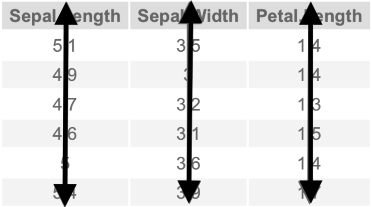
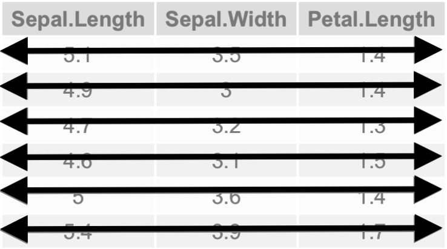
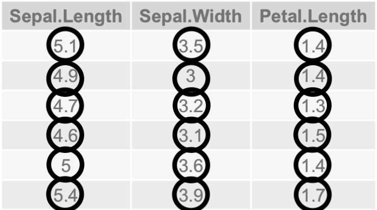

# Limpieza de datos: Tidyr

En un análisis de datos, gran parte del tiempo que se utiliza es dando un grado de limpieza a estos, para así ya solo obtener información resumen, aplicar modelos o manipularlos para descubrir algo en ellos. De acuerdo a las fuentes que se consulten, esto puede tomar hasta un 80% del tiempo que se dispone, por lo que es evidente la necesidad de tener funciones que ayuden con dicha tarea.

La limpieza de datos varía dependiendo de los fines, pero para Hadley Wickham (Chief Scientist en RStudio y alguien importante en desarrollo y mantenimiento del tidyverse) tener una limpieza en los datos requiere de ciertas características. La información completa se puede encontrar en artículo de Hadley, [Tidy Data](http://vita.had.co.nz/papers/tidy-data.pdf), pero básicamente se tienen 3 puntos importantes para considerar que los datos son limpios.

+ Cada variable forma una columna.
+ Cada observación forma un renglón.
+ Cada valor debe tener su propia celda.

Las siguientes gráficas representan dichos puntos sobre un subconjunto de `Iris`.

<style>
* {
  box-sizing: border-box;
}

.column {
  float: left;
  width: 33.33%;
  padding: 5px;
}

/* Clearfix (clear floats) */
.row::after {
  content: "";
  clear: both;
  display: table;
}
</style>

<div class="row">
<div class="column"></div>
<div class="column"></div>
<div class="column"></div>
</div>

<br>

Con lo anterior establecido y suponiendo que se esta analizando una pequeña base de datos correspondientes a las calificaciones de ciertos alumnos ¿Cuál de las siguientes estructuras es correcta?

+ Colocando las observaciones respecto a los nombres

```{r, echo = FALSE}
library(knitr)
library(kableExtra)
library(tidyverse)
fake_1 <- data_frame(" "= c("Juan", "Carlos", "Luis", "Allison", "Leticia"),
                     "Matemáticas" = c(8,9,7,9,8), 
                     "Química" = c(9,7,8,9,9))
kable(fake_1, align = "ccc") %>%
  kable_styling(bootstrap_options = c("striped", "hover", "condensed", "responsive"))
```

+ Colocando las observaciones respecto a la materia

```{r, echo = FALSE}
fake_2 <- data_frame(" "= c("Matemáticas", "Química"),
                     "Juan" = c(8,9), 
                     "Carlos" = c(9,7),
                     "Luis" = c(7,8), 
                     "Allison" = c(9,9),
                     "Leticia" = c(8,9))
kable(fake_2, align = "cccccc") %>%
  kable_styling(bootstrap_options = c("striped", "hover", "condensed", "responsive"))
```

De hecho, ninguna de las dos opciones anteriores es correcta. De acuerdo a los principios anteriores para tener datos limpios, cada variable debe formar una columna, lo cual no sucede en este caso, ya que las variables aquí son estudiante o el nombre, la materia y las calificaciones. Es decir, que las configuración correcta es la siguiente

```{r, echo=FALSE}
fake_3 <- data_frame("Nombre"= c("Juan", "Carlos", "Luis", "Allison", "Leticia",
                                 "Juan", "Carlos", "Luis", "Allison", "Leticia"),
                     "Asignatura" = c(rep("Matemáticas", 5), rep("Química", 5)),
                     "Calificaciones" = c(8,9,7,9,8, 9,7,8,9,9))
kable(fake_3, align = "ccc") %>%
  kable_styling(bootstrap_options = c("striped", "hover", "condensed", "responsive"))
```

Esto es uno de los tantos ejemplos que se pueden dar cuando se trabajando con datos. En el momento en que se identifican estos problemas, se deberá usar toda la creatividad para resolverlos y obtener una estructura con la que ya se pueda trabajar. El paquete `tidyr` ayudará con la mayoría de estos.

Como recomendación, se aconseja tener a la mano siempre la respectiva Cheat Sheet que pueda ser de utilidad, en este caso de la librería `tidyr` se pueden consultar [Data import](https://github.com/rstudio/cheatsheets/raw/master/data-import.pdf) y [Data Wrangling](https://rstudio.com/wp-content/uploads/2015/02/data-wrangling-cheatsheet.pdf); las respectivas traducciones al español se pueden encontrar en la página oficial de [Cheat Sheets de RStudio](https://rstudio.com/resources/cheatsheets/).

Como bien dice Hadley en [Tidy Data](http://vita.had.co.nz/papers/tidy-data.pdf), hay cinco problemas comunes en los _messy datasets_:

+ Los encabezados son valores y no nombres de dichas variables.
+ Múltiples variables están contenidas en una sola.
+ Existen variables que están almacenadas tanto en renglones como columnas.
+ Múltiples tipos de observaciones están en la misma tabla.
+ Una sola observación esta en múltiples tablas.

En la sección anterior se presentaron los datos para la población por sexo y entidad federativa según grupos de edad quinquenales de acuerdo a los [tabulados básicos](http://www.conapo.gob.mx/es/CONAPO/Tabulados_basicos) de la CONAPO

```{css, echo=FALSE}
.scroll-300 {
  max-height: 300px;
}
```

```{r, class.output = "scroll-300"}
colnames(Population_FEntity)[1:2] <- c("Entidad Federativa", "Población Total")
Population_FEntity
```

En las primeras dos columnas se cambiaron los nombres con las herramientas que hasta este momento se tienen. Véase que las demás columnas representan rangos de edad, por lo que se tiene el primer problema en los _messy datasets_. De hecho, en estos datos las variables son la Entidad Federativa, la Población Total, el Rango de Edad y el Porcentaje de la población total en ese rango de edad.

En estos casos se dice los datos son anchos, y lo que se desea es que estos estén en un formato largo (ancho por la cantidad de columnas y largo por la cantidad de observaciones). Para tales casos se utiliza la función `tidyr::gather()` la cual recibe como parámetros múltiples columnas y colapsa la información de estas en dos variables.

```{r, class.output = "scroll-300"}
(Population_FEntity <- gather(data = Population_FEntity, key = "Rango_edad", value = "Porcentaje", -c("Entidad Federativa", "Población Total")))
```
Con lo anterior se logro tener una mejor estructura en los datos, con lo cual fácilmente se podrían crear gráficas, modelos y estadísticas de resumen por Entidad Federativa o por rango de edad. Después de tener la información con una estructura adecuada, la imaginación es el único limitante. En el siguiente capítulo se verá como manipular internamente los datos para que se tenga una mejor semántica en ellos.

Si se desea por algún motivo, lo cual puede suceder, tener los datos en formato ancho, se puede usar la función complementaria la cual es `tidyr::spread()`

```{r, class.output = "scroll-300"}
Population_FEntity %>% spread(key = "Rango_edad",value = "Porcentaje")
```
Finalmente:

+ Un equivalente de la función `tidyr:: gather()` la proporciona el paquete `reshape` con su función `melt()`.
+ Para la función `tidyr:: spread()` se tiene la función `reshape::dcast()`.
+ Depende de la versión que se utilice, las funciones `gather()` y `spread()` podrían haber sido remplazadas por las funciones `tidyr::pivot_longer()` y `pivot_wider()` respectivamente.
+ En otros lenguajes de programación, a estas técnicas se les conoce como pivoteo.

Para ver un ejemplo del segundo punto, supóngase que los datos vistos al inicio donde se relacionaban las calificaciones de ciertos alumnos tienen originalmente la siguiente estructura

```{r, echo=FALSE}
(Student_grades <- fake_3 %>% mutate(Asignatura = if_else(Asignatura=="Matemáticas", "M", "Q")) %>% unite("A/C", c("Asignatura", "Calificaciones"), sep = ""))
```
En tal caso, la segunda variable contiene la información tanto de la materia como de la calificación. Aquí la función `tidyr::separate()` es de gran ayuda

```{r}
(Student_grades <- Student_grades %>% separate(col = "A/C", into = c("Asignatura", "Calificaciones"), sep = 1))
```
+ En el argumento `sep` se da la posición dentro del texto para separar los datos.

En el caso en que se desee tener el caso inverso, se utiliza la función `tidyr::unite()`

```{r}
Student_grades %>% unite("A/C", c("Asignatura", "Calificaciones"), sep = "")
```
Otro ejemplo lo proporciona la Cheat Sheet [Data Wrangling](https://rstudio.com/wp-content/uploads/2015/02/data-wrangling-cheatsheet.pdf).

```{r, echo=FALSE, class.output = "scroll-300"}
(storms <- dplyr::storms %>% unite(date, c("year", "month", "day"), sep = ""))
```
```{r, class.output = "scroll-300"}
separate(storms, col = date ,into =  c("year", "month", "day"), sep = c(4, 5))
```
+ Se tiene un equivalente para separar en renglones: `tidyr::separate_rows()`
+ Un equivalente la función `separate()` esta dada por `reshape::colsplit()`.

En el caso que se tenga el problema donde algunas variables esten almacenadas tanto en renglones como columnas se debe tratar el problema como lo anterior visto, primero abstraerse al problema de juntar las columnas necesarias en dos variables con la función `gather()` para posteriormente separar las variables que lo requieran con la función `separate()`.

Para los últimos dos casos se necesita hacer uso de unas funciones del paquete `dplyr`, el cual ser verá en la siguiente sección. Por el momento, se pueden ver otras funciones útiles de `tidyr`, como aquellas que ayudan en la obtención de diferentes operaciones de conjuntos en los datos.

```{r}
df <- data_frame(x = 1:2, y = 2:1)
tidyr::expand_grid(df, z = 1:3)
```
La función `tidyr::expand_grid()` crea un tibble de todas las combinaciones de sus inputs, estos pueden ser data frames o tibbles, matrices y hasta vectores. Se puede entender a esta función como el producto cartesiano de dos conjuntos.

```{r}
x <- data_frame(x = letters[5:7])
y <- data_frame(c(3,3,1))
crossing(x, y)
```

La función `tidyr::crossing()` regresa un tibble y tiene un comportamiento similar a `expand_grid()` con la diferencia de eliminar registros duplicados.

```{r}
set.seed(20)
x <- data_frame(sample(letters[1:3], size = 5, replace = T))
y <- data_frame(y = sample(1:3, size = 5, replace = T))
tidyr::nesting(x, y)
```

La función `tidyr::nesting()` encuentra las posibles combinaciones entre los datos, es decir, las combinaciones entre los datos de entrada si estos se unieran en uno solo.

```{r}
set.seed(20)
reduced_iris <- iris %>% head()
df <- reduced_iris[sample(1:6, size = 10, replace = T),]
df %>% tidyr::expand(Petal.Length)
```

La función `tidyr::expand()` genera todas las combinaciones de variables que se encuentran en un data set.

+ ¿Qué sucede al ejecutar `df %>% tidyr::expand(Sepal.Width, Petal.Width)`?
+ ¿Y al ejecutar ` df %>% tidyr::expand(nesting(Sepal.Width, Petal.Width))`?

Otras funciones útiles son las siguientes

+ `tidyr::nest()`. Dicha función anida un data frame o un subconjunto de este en listas y coloca estos como observaciones; esto puede ser muy útil en la aplicación de modelos.
+ `tidyr::unnest()`. Función inversa a `tidyr::nest()`.
+ `tidyr::replace_na()`. Dicha función encuentra los valores perdidos en un data set y los cambia por un valor dado.

***

#### Ejercicios {-}

77. En la sección _Limpieza de datos: Tidyr_ se vieron varios ejemplos donde se mencionaba que estos venían como sugerencias de las respectivas Cheat Sheets. Dichos datos fueron manipulados para ver el uso de las funciones que se estaban presentando. Obtén la estructura de los datos a los cuales se les aplicaron dichas funciones.

78. Investigar otras funciones de `tidyr` como `chop()`, `complete()` y `pack()`.